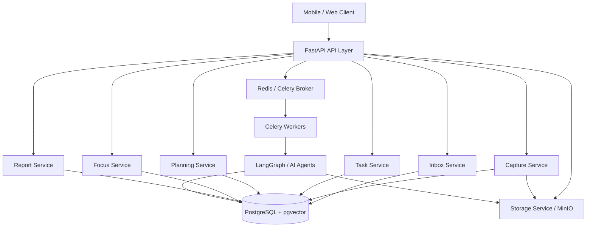

# Chronos Backend Architecture v1

> 面向后续项目开发的后端架构与业务模块设计。  
> 本文以产品信息架构和交互流程为主要依据，PRD V3.5 作为长期能力池参考。

---

## 0. 关联文档

- [Chronos Product Positioning](./chronos-product-positioning.md)：产品定位、核心价值、外部 pitch 和决策原则。
- [Chronos Product Design Principles](./chronos-product-design-principles.md)：产品人格、体验约束和页面设计护栏。
- [Chronos Competitive Analysis](./chronos-competitive-analysis.md)：竞品边界、差异化地图和产品取舍。
- [Chronos App 产品信息架构](./chronos-information-architecture-final.md)：页面结构、核心路径和分期建议。
- [Chronos Interaction Flow Design](./chronos-interaction-flow-design.md)：交互主路径、页面跳转和后端对象映射。
- [Chronos LLM & Agent Architecture](./chronos-llm-agent-architecture.md)：LLM 接入、Agent 职责、AIJob 生命周期和 fallback 策略。
- [Chronos Engineering Guidelines](./chronos-engineering-guidelines.md)：代码结构、分层调用、数据/API/AI/测试开发规范。
- [Chronos P2 Frontend API Contract](./chronos-p2-frontend-api-contract.md)：P2 前端接口合同总览。
- [Chronos PRD V3.5](./chronos-prd-v3.5.md)：长期愿景、能力池和路线图。
- [Iteration Docs](./iterations/README.md)：需求迭代文档规范和模板。

---

## 1. 文档定位

Chronos 的后端不只是一个 Task CRUD 服务，而是一个围绕每日执行闭环构建的执行系统。

核心闭环：

```text
Capture -> Inbox -> Today -> Task Detail -> Focus -> Report
```

本文用于指导：

- 后端业务模块拆分
- 数据模型设计
- API 设计
- AI Worker / Agent 职责
- P1 到 P4 的开发优先级
- 后续工程实现时的产品约束

优先级规则：

1. 信息架构和交互流程是当前落地蓝图。
2. PRD V3.5 是长期愿景和能力池，不代表所有内容都进入 P1。
3. 竞品对比和产品定位用于约束取舍，避免后端过早膨胀。

---

## 2. 产品定位对后端的要求

Chronos 是一款 AI Execution OS，面向高自驱但日常规划成本过高的人群，帮助他们把分散任务、目标和临时输入，持续编排成每天可执行、可反馈、可优化的行动序列。

它不是普通 AI Todo App。

Chronos 的核心价值不是“记录任务”，而是：

```text
持续降低用户每天的规划成本，
保护高价值任务不被琐事挤掉，
让用户更容易开始今天。
```

因此，后端设计重点不是单纯的任务列表，而是以下几个能力：

- 输入整理：把零散输入沉淀为可确认的候选任务 / 目标
- 每日编排：生成并保存当天计划快照
- 执行记录：记录用户真实行为，而不是只保存任务当前状态
- 反馈学习：基于执行结果、用户修正和行为事件优化后续安排
- 可解释与可信：保存 AI 决策依据，但默认只向用户展示克制的摘要

---

## 3. 产品设计约束

Chronos 的产品人格是：

```text
轻盈、克制、清澈、安静、有判断、不施压、可信赖、有节奏感。
```

工程实现需要遵守这些约束：

- 不要让 Today 变成复杂驾驶舱。
- 不要让 Task Detail 变成信息仓库。
- 不要让 Focus 变成控制面板。
- 不要让洞察和解释抢走行动感。
- 不要让“聪明”压过“可信”。

对应到后端：

- API 不应把所有底层数据一股脑返回给前端。
- 优先提供面向页面的聚合接口，同时保留底层资源接口。
- AI 解释要可追溯，但默认只返回轻量摘要。
- 用户对 AI 建议的接受、忽略、调整都要被记录。
- 复杂度可以存在于数据层和服务层，但用户可见结果必须清晰、少而准。

---

## 4. 竞品边界带来的架构取舍

### Motion

Motion 是 AI 工作套件和自动化中枢。Chronos 不应在早期走全家桶路线。

后端取舍：

- P1 不做复杂项目管理、会议、文档、企业搜索。
- 重点做每日执行编排，而不是工作套件平台。

### Sunsama

Sunsama 是成熟的 guided planning 产品。Chronos 要保持安静感，但比 Sunsama 更主动地承担编排。

后端取舍：

- 需要 DailyPlan 快照，而不是仅提供“用户自己计划”的辅助字段。
- AI 调度结果需要持久化，供用户查看、修正和复盘。

### Todoist

Todoist 强在可靠、清晰、可预测。Chronos 即使有 AI，也不能牺牲基础任务系统的稳定性。

后端取舍：

- Task、状态、步骤、完成记录必须扎实。
- AI 不能绕过任务状态机直接改乱数据。

### Reclaim

Reclaim 是 calendar intelligence。Chronos 是 execution intelligence。

后端取舍：

- P1 不需要做复杂日历排程。
- DailyPlan 的核心是推荐执行顺序，不是自动填满时间块。

### Notion AI

Notion AI 是 workspace/context intelligence。Chronos 是 execution context intelligence。

后端取舍：

- P1 不做知识库平台。
- 优先沉淀任务、目标、执行行为、计划和反馈数据。

---

## 5. 总体架构



当前技术栈：

- API：FastAPI
- ORM：SQLAlchemy
- 配置：pydantic-settings
- 异步任务：Celery + Redis
- AI 编排：LangGraph
- 数据库：PostgreSQL + pgvector
- 对象存储：MinIO / S3 compatible
- 包管理：uv

---

## 6. P1 范围

P1 只证明一件事：

```text
用户打开 Today 后，真的更容易开始今天。
```

P1 必须跑通：

- Capture：文本输入
- Inbox：待处理池和用户确认
- Task：创建、编辑、完成、延后、拆解
- Light Goal：轻量目标关联
- Today：今日计划和推荐执行顺序
- Task Detail：执行前承接页
- Focus：专注执行与行为记录
- Daily Report：每日反馈
- Me：基础数据总览和设置入口
- 基础 AI：解析、排序、拆解、每日建议

P1 暂不深入：

- 语音输入
- 图片输入
- 日历 / 邮件 / 健康数据接入
- Energy Dashboard
- Weekly / Monthly Report
- 深度 Insights
- Gamification
- Social / Groups / Friends
- 多人任务分配
- 吉祥物增强反馈

这些能力保留扩展位，但不抢 P1 主线。

### 6.1 P1 实现决策

为了避免开发时反复摇摆，P1 先采用以下默认决策：

- 用户体系：P1 采用单用户开发模式，但数据库保留 `user_id`。后端提供 `get_current_user` 开发 stub，默认返回 seed user；不在 P1 做完整注册、登录和权限系统。
- AI 接入：P1 支持真实 LLM adapter，但核心流程必须有规则 fallback / mock AI 输出。不能让 Capture、Today、Focus、Report 因 LLM 不可用而不可用。
- DailyPlan 生成时机：用户首次打开当天 `Today` 时，如果不存在 active plan，则 lazy create；用户主动 replan 时生成新 version。
- Focus 范围：P1 只做 start / complete / interrupt / postpone。`pause` 状态保留，但不作为 P1 必做。
- DailyReport 生成时机：P1 支持按需生成并持久化。首次打开当日 report 或调用 generate 时创建快照；当天未结束前允许 refresh。
- Goal 边界：P1 的 Goal 是轻量关联对象，服务任务归属和快速创建；不实现完整 Goals Tab / Goal Detail 聚合体验。

---

## 7. 业务模块设计

### 7.1 Capture Module

职责：

- 接收用户原始输入。
- 保存输入来源、内容、附件。
- 触发 AI 解析任务。
- 将解析结果转入 Inbox。

P1 输入类型：

- 文本输入

P3 扩展：

- 语音输入
- 图片输入
- 邮件 / 日历来源
- 外部来源条目导入

核心对象：

- CaptureInput
- AIParseResult

P3 扩展对象：

- ExternalCaptureImport
- Attachment

### 7.2 Inbox Module

职责：

- 作为 AI 解析结果和正式任务库之间的缓冲层。
- 支持用户确认、编辑、归类、丢弃。
- 避免 AI 直接污染正式任务库。

核心动作：

- 暂存到 Inbox
- 确认生成 Task
- 确认生成 Goal
- 关联已有 Goal
- 编辑后确认
- 丢弃

核心对象：

- InboxItem

### 7.3 Task Module

职责：

- 管理任务主数据。
- 管理任务步骤。
- 管理任务状态。
- 支持快速完成、延后、拆解、编辑。
- 支持 P2 任务依赖边，表达“前置任务 -> 后续任务”的执行顺序关系。

核心动作：

- 创建任务
- 编辑任务
- 完成任务
- 延后任务
- 调整优先级 / 价值等级
- 拆解任务
- 勾选步骤
- 关联 Goal
- 添加 / 删除任务依赖

核心对象：

- Task
- TaskStep
- TaskDependency
- ActivityEvent

### 7.4 Goal Module

P1 只做轻量 Goal，P2 逐步补齐 Goals 首页、Goal Detail 和 Dependency Map。

职责：

- 支持任务归属。
- 支持快速创建 Goal。
- 支持目标标题、deadline、价值等级。
- 提供 Goal selector 所需的轻量列表。

P1 不做：

- Goals Tab 聚合页
- Goal Detail 深度页
- Dependency Map
- 目标洞察

P2 已扩展：

- Goal Detail
- Goal Progress / Timeline（Timeline 已支持轻量事件聚合）
- Dependency Map：已支持目标内真实任务依赖边
- Goal AI Suggestion

P2 后续继续扩展：

- 高价值目标分析

核心对象：

- Goal

### 7.5 Today / Planning Module

职责：

- 生成当天推荐执行顺序。
- 保存 DailyPlan 快照。
- 保存 AI 策略摘要和解释元数据。
- 支持重新安排和快速操作。

Today 不是任务列表，而是每日执行入口。

核心原则：

- 一天至少有一个 active DailyPlan。
- 每次 AI 重排都生成新的 plan version 或 revision。
- 用户手动调整计划也要记录。
- Today 默认返回轻量摘要，不返回完整评分细节。
- P2 起 Today planner 升级为 Planning Engine v1：读取任务价值、优先级、deadline、估时、依赖、用户优先级修正、行为反馈、当日容量和 Energy 信号。
- Planning Engine v1 会为每个 DailyPlanItem 保存 `score_breakdown`，但 Today 首屏只显示分区、顺序和简短推荐理由；完整评分只进入 Strategy Detail。
- 超出当日容量的非保护任务进入 `rolled_over`，保留可见但不挤占主执行序列。
- 系统容量滚动只改变 `DailyPlanItem.section=rolled_over`，不把 Task 本体改成 postponed；用户手动延后仍通过 Task / item status 表达。
- 当受保护任务总时长超过容量时，Strategy Detail 返回 `capacity_status=overloaded` 和 `over_capacity_minutes`；Today 只给一条轻量风险提示，不展示容量驾驶舱。

核心对象：

- DailyPlan
- DailyPlanItem
- StrategySnapshot
- PlanRevision

### 7.6 Task Detail Module

Task Detail 是执行前承接层。

职责：

- 展示任务基本信息。
- 展示所属 Goal。
- 展示当前 AI 建议。
- 展示任务步骤。
- 展示轻量来源上下文，让用户知道外部任务来自日历或邮件。
- 给出下一步动作。

设计约束：

- 不要返回过多历史信息。
- 不要把它变成任务信息仓库。
- Task Detail 只返回来源摘要、外部标题、正文预览和关联 id。
- 复杂历史、完整外部 payload、完整邮件正文、完整日历对象应通过单独接口获取。

### 7.7 Focus Module

Focus 是执行场景。

职责：

- 创建 FocusSession。
- 记录开始、中断、完成、延后。
- 记录步骤勾选。
- 记录实际专注时长。
- 将行为写入 ActivityEvent。

设计约束：

- Focus 页面只服务执行。
- AI 提示要非常轻量。
- 完成 / 中断 / 延后必须形成可追溯事件。
- `pause` 是预留状态，不进入 P1 实现。

核心对象：

- FocusSession
- ActivityEvent

### 7.8 Report Module

P1 做 Daily Report；P2 已补 Weekly / Monthly Report 轻量聚合和 Insight Detail。

职责：

- 汇总当天任务完成情况。
- 汇总 Focus 时长。
- 汇总延后 / 中断记录。
- 生成每日 AI 建议。
- 作为后续 Rolling Plan 的行为反馈。
- 汇总每周完成趋势、高价值任务推进、滞后任务和专注总量。

P2 扩展：

- Weekly Report：已支持轻量聚合，不持久化。
- Monthly Report：已支持轻量聚合，不持久化。
- Insight Detail：已支持轻量规则洞察。

核心对象：

- DailyReport

### 7.9 Me Module

P1 的 Me 是基础数据总览和设置入口。

职责：

- 返回今日完成率。
- 返回本周 Focus 时长。
- 返回基础连续使用信息。
- 返回设置项。
- 汇总 Reports 入口。
- 汇总 P2 轻量 Insights 概览入口。

P2 / P3 / P4 扩展：

- Insights
- Energy
- Data Sources
- Social
- Gamification

### 7.10 Data Source Module

Data Source 是 P3 自然生长模块的权限和连接状态底座，服务日历、邮件、健康数据接入。

职责：

- 记录用户连接了哪些外部数据来源。
- 记录连接状态、授权范围、同步开关、最近同步时间和非敏感元数据。
- 为后续 Calendar / Email / Health worker 提供统一入口。
- 为 Calendar / Email connector worker 提供占位同步服务。
- 为 Calendar / Email provider adapter 提供稳定接口；当前实现为 fake provider。
- 让 Me / Settings 能展示数据接入状态。

边界：

- 不保存真实 OAuth token。
- 当前不直接拉取真实外部数据；fake provider 只从连接 metadata 读取测试 item。
- 不把外部来源任务直接写入 Task；Calendar / Email 条目必须先通过 ExternalCaptureImport 进入 Capture / Inbox。

核心对象：

- DataSourceConnection

### 7.11 AI Agent / Worker Module

职责：

- 执行耗时 AI 任务。
- 通过 Celery 异步运行。
- 使用 LangGraph 编排复杂工作流。
- 将 AI 输出以结构化结果回写数据库。

P1 Agent：

- Capture Parser：解析输入为 Task / Goal / Inbox 候选项
- Daily Planner：基于 Planning Engine candidates 输出结构化审阅和建议，业务层校验后生成今日推荐顺序
- Strategy Explanation：解释 Planning Engine v1 的排序因子，不改变计划
- Task Breakdown：拆解任务步骤
- Daily Report Generator：生成每日复盘建议
- Insight Detail：解释周级行为模式和策略建议，不改变业务状态

P3 Worker：

- Data Source Sync：读取 Calendar / Email 连接状态，通过 provider adapter 获取规范化 item，并通过 ExternalCaptureImport 进入 Capture / Inbox。
- Fake Provider Adapter：从 `DataSourceConnection.connection_metadata.fake_items` 读取规范化测试条目，为真实 provider adapter 固定接口。

关键要求：

- LLM 输出必须经过 schema 校验。
- Daily Planner v1 不允许 LLM 直接改变任务集合、排序或 section；PlanningService 负责校验和取舍。
- AI 任务失败时要保留失败状态和错误信息。
- 所有异步 AI 执行都要有 AIJob / AgentRun 记录，供前端轮询和失败重试。
- 核心流程要有 deterministic fallback，不能因为 AI 失败导致用户无法使用。
- AI 决策要保存摘要和必要元数据，便于后续解释和学习。

---

## 8. 核心数据模型

以下是 P1 推荐模型，不代表最终数据库字段的完整定义。

### User

```text
User {
  id
  email
  name
  avatar_url
  created_at
  updated_at
}
```

### UserSettings

```text
UserSettings {
  id
  user_id
  notification_enabled
  reminder_execution_enabled
  reminder_deadline_enabled
  reminder_channel_in_app_enabled
  reminder_channel_push_enabled
  reminder_channel_email_enabled
  execution_reminder_limit
  execution_reminder_start_hour
  execution_reminder_spacing_minutes
  deadline_reminder_hour
  focus_mode_default_minutes
  planning_preference
  ai_strategy_preference
  created_at
  updated_at
}
```

### DataSourceConnection

```text
DataSourceConnection {
  id
  user_id
  source_type              // calendar | email | health
  provider                 // google_calendar | gmail | apple_health ...
  status                   // disconnected | connected | needs_reauth | paused
  external_account_label
  scopes
  sync_enabled
  sync_cursor
  last_sync_at
  connected_at
  revoked_at
  metadata
  created_at
  updated_at
}
```

说明：

- 该模型只保存连接状态和非敏感元数据，不保存 OAuth token。
- P3 后续同步 worker 应读取该表决定是否可同步。
- 外部数据导入后应进入 Capture / Inbox，不直接绕过确认层写入正式任务。

### ExternalCaptureImport

```text
ExternalCaptureImport {
  id
  user_id
  data_source_connection_id
  source                  // calendar | email
  provider
  external_item_id
  external_item_type
  title
  body
  occurred_at
  normalized_text
  external_payload
  capture_input_id
  inbox_item_id
  created_at
  updated_at
}
```

说明：

- 记录外部 Calendar / Email 条目与 Chronos Capture / Inbox 的映射。
- 通过 `user_id + source + provider + external_item_id` 保证幂等导入。
- 用户确认 Inbox 生成 Task 后，Task Detail 可通过该映射返回轻量 `source_context`。
- Health 数据不走该模型；后续应进入 Energy / Health 专用数据模型。

### DataSourceSyncRun

```text
DataSourceSyncRun {
  id
  user_id
  data_source_connection_id
  source_type
  provider
  status                  // running | succeeded | skipped | failed
  trigger                 // worker | ready_batch | manual
  attempt
  max_attempts
  retryable
  next_retry_at
  skip_reason
  error_message
  processed_count
  imported_count
  reused_count
  fetched_from_provider
  provider_mode
  sync_cursor_before
  sync_cursor_after
  started_at
  finished_at
  duration_ms
  metadata
  created_at
  updated_at
}
```

说明：

- 记录每次 Data Source 同步尝试的结构化结果。
- ActivityEvent 继续负责行为时间线；DataSourceSyncRun 负责 worker 观测和 retry 判断。
- 失败时记录 `retryable` 和 `next_retry_at`，但当前不自动重试。
- 不保存外部 token 或完整第三方响应。

### EnergyDailyMetric

```text
EnergyDailyMetric {
  id
  user_id
  data_source_connection_id
  metric_date
  source                  // manual | health_import | estimated
  sleep_minutes
  sleep_quality_score
  stress_score
  energy_score
  note
  metadata
  created_at
  updated_at
}
```

说明：

- 记录 Energy Dashboard 需要的日级聚合数据，不保存原始健康平台 payload。
- 同一用户同一天只保留一条聚合 metric，重复写入视为更新。
- Health 数据不进入 Capture / Inbox，也不直接生成 Task。
- 当前 `energy_score` 可由睡眠和压力轻量推导；后续真实 Health provider 可写入同一模型。

### Reminder

```text
Reminder {
  id
  user_id
  task_id
  goal_id
  title
  message
  reminder_type          // execution | deadline | system | team
  status                 // scheduled | sent | dismissed | canceled
  scheduled_for
  channel                // in_app | push | email
  source                 // manual | system | ai | worker
  seen_at
  dismissed_at
  sent_at
  metadata
  created_at
  updated_at
}
```

说明：

- Reminder 是 P3 自动提醒和提醒中心的承接层。
- 当前只记录提醒和用户 dismiss，不执行真实推送。
- 一个 reminder 最多关联一个 Task 或一个 Goal。
- Reminder 不改变 Task / Goal / Today 状态。
- `deadline` reminders 可由 Task / Goal deadline 规则生成。
- `execution` reminders 可由已有 Today active plan 的 pinned / recommended planned items 规则生成，但不创建 Today、不 replan。

### ReminderDeliveryAttempt

```text
ReminderDeliveryAttempt {
  id
  user_id
  reminder_id
  channel
  provider
  status                 // sent | skipped
  reason
  attempted_at
  next_retry_at
  metadata
  created_at
  updated_at
}
```

说明：

- 记录 reminder dispatch 的 delivery 尝试结果。
- 当前用于避免未配置 push / email provider 被每次 dispatch 重复尝试。
- `sent` attempt 对应 Reminder 状态流转为 `sent`。
- `skipped` attempt 会设置轻量 cooldown，Reminder 保持 `scheduled`。

### CaptureInput

```text
CaptureInput {
  id
  user_id
  input_type              // text | voice | image | external
  raw_text
  attachment_url
  source                  // manual | voice | image | email | calendar
  status                  // received | parsing | parsed | failed | archived
  created_at
  updated_at
}
```

### AIParseResult

```text
AIParseResult {
  id
  capture_input_id
  result_type             // task | goal | idea | calendar_item | unknown
  title
  description
  estimated_duration_min
  suggested_priority
  suggested_deadline
  suggested_goal_id
  confidence
  raw_model_output
  created_at
}
```

### InboxItem

```text
InboxItem {
  id
  user_id
  capture_input_id
  parse_result_id
  item_type               // task | goal | idea | unknown
  title
  description
  suggested_goal_id
  suggested_priority
  suggested_deadline
  status                  // pending | confirmed | edited | discarded
  created_at
  updated_at
}
```

### Goal

```text
Goal {
  id
  user_id
  title
  description
  deadline
  value_level             // low | medium | high
  status                  // active | completed | archived
  created_at
  updated_at
}
```

### Task

```text
Task {
  id
  user_id
  goal_id
  title
  description
  estimated_duration_min
  actual_duration_min
  priority
  value_level
  deadline
  progress                // 0.0 - 1.0
  status                  // active | in_focus | completed | postponed | archived
  source                  // manual | capture | ai | email | calendar
  created_at
  updated_at
}
```

### TaskStep

```text
TaskStep {
  id
  task_id
  title
  sort_order
  is_completed
  completed_at
  created_at
  updated_at
}
```

### TaskDependency

```text
TaskDependency {
  id
  user_id
  prerequisite_task_id    // 前置任务
  dependent_task_id       // 后续任务
  reason
  created_at
  updated_at
}
```

说明：

- 依赖方向统一为 `prerequisite_task -> dependent_task`。
- 同一用户下不允许重复边，不允许自依赖，不允许形成环。
- Task Detail 返回当前任务的前置任务和后续任务；Goal Detail 只返回同一目标内的依赖边。

### ActivityEvent

```text
ActivityEvent {
  id
  user_id
  entity_type             // task | capture | inbox | daily_plan | focus_session | ai_job | report
  entity_id
  related_task_id
  related_daily_plan_id
  related_focus_session_id
  event_type              // TASK_COMPLETED | FOCUS_STARTED | AI_SUGGESTION_MODIFIED | ...
  actor_type              // user | ai | system
  source                  // api | worker | scheduler
  payload                 // json
  idempotency_key
  occurred_at
}
```

### DailyPlan

```text
DailyPlan {
  id
  user_id
  plan_date
  status                  // draft | active | closed
  current_version
  current_revision_id
  total_estimated_minutes
  completed_count
  focus_minutes
  created_by              // ai | user | system
  created_at
  updated_at
}
```

### PlanRevision

```text
PlanRevision {
  id
  daily_plan_id
  version
  trigger                 // initial | replan | manual_adjust | system_refresh
  created_by              // ai | user | system
  reason
  diff_payload            // json, records added / removed / reordered plan items
  created_at
}
```

### StrategySnapshot

```text
StrategySnapshot {
  id
  daily_plan_id
  plan_revision_id
  summary
  mode                    // light | normal | sprint
  primary_reason
  score_factors           // json, not returned by default Today API
  model_name
  prompt_version
  created_at
}
```

### DailyPlanItem

```text
DailyPlanItem {
  id
  daily_plan_id
  plan_revision_id
  task_id
  sort_order
  section                 // pinned | recommended | low_priority | rolled_over
  recommendation_reason
  estimated_duration_min
  score_breakdown          // json, Planning Engine v1 per-task factors
  status                  // planned | completed | postponed | skipped
  created_at
  updated_at
}
```

### FocusSession

```text
FocusSession {
  id
  user_id
  task_id
  daily_plan_id
  started_at
  ended_at
  planned_duration_min
  actual_duration_min
  status                  // active | paused | completed | interrupted | postponed
  interruption_reason
  created_at
  updated_at
}
```

### DailyReport

```text
DailyReport {
  id
  user_id
  daily_plan_id
  report_date
  completed_task_count
  postponed_task_count
  interrupted_count
  focus_minutes
  completion_rate
  ai_summary
  ai_suggestions
  generated_from_plan_version
  refreshed_at
  created_at
  updated_at
}
```

### AIJob

```text
AIJob {
  id
  user_id
  job_type                // capture_parser | daily_planner | strategy_explanation | task_breakdown | daily_report_generator | insight_generator
  status                  // queued | running | succeeded | succeeded_with_fallback | failed | canceled
  input_entity_type
  input_entity_id
  result_entity_type
  result_entity_id
  celery_task_id
  provider
  model
  prompt_version
  latency_ms
  error_message
  retry_count
  metadata                // json
  started_at
  finished_at
  created_at
  updated_at
}
```

---

## 9. 事件模型

Chronos 的长期壁垒来自用户的个体化执行数据、行为模式和调度偏好。

因此，后端必须记录事件，而不是只更新当前状态。

P1 推荐事件类型：

```text
CAPTURE_CREATED
CAPTURE_PARSED
INBOX_ITEM_CONFIRMED
INBOX_ITEM_DISCARDED
TASK_CREATED
TASK_UPDATED
TASK_STARTED
TASK_STEP_COMPLETED
TASK_COMPLETED
TASK_POSTPONED
TASK_INTERRUPTED
TASK_BROKEN_DOWN
DAILY_PLAN_CREATED
DAILY_PLAN_REPLANNED
DAILY_PLAN_ITEM_REORDERED
AI_SUGGESTION_ACCEPTED
AI_SUGGESTION_IGNORED
AI_SUGGESTION_MODIFIED
FOCUS_STARTED
FOCUS_COMPLETED
FOCUS_INTERRUPTED
REPORT_GENERATED
```

事件设计原则：

- P1 统一写入 ActivityEvent。
- 状态字段用于当前查询，事件用于历史、复盘和学习。
- AI 触发的变化和用户手动变化都要区分来源。
- 用户对 AI 建议的修改要保存，这是后续偏好学习的关键。
- ActivityEvent 是事实记录，不替代业务表当前状态；业务表用于高频查询，事件表用于复盘、学习和审计。

---

## 10. 状态机设计

### InboxItem

```text
pending -> confirmed
pending -> discarded
pending -> edited -> confirmed
```

### Task

```text
active -> in_focus -> completed
active -> postponed -> active
active -> archived
in_focus -> interrupted -> active
in_focus -> postponed
```

### DailyPlan

```text
draft -> active -> closed
active -> active     // replan creates a new PlanRevision, not a new status
```

### FocusSession

```text
active -> completed
active -> interrupted
active -> postponed
active -> paused -> active
```

### AIJob

```text
queued -> running -> succeeded
queued -> running -> failed
queued -> running -> succeeded_with_fallback
failed -> queued
running -> canceled
```

---

## 11. P1 API 设计

API 采用两类接口：

- 页面聚合接口：服务 Today、Task Detail、Me 等高频页面。
- 资源操作接口：服务 Task、Inbox、Focus 等底层动作。

### Capture

```text
POST /api/v1/captures
POST /api/v1/captures/external-imports
GET  /api/v1/captures/{capture_id}
```

说明：

- `POST /captures` 创建输入并触发解析任务。
- P1 支持文本输入。
- `POST /captures/external-imports` 服务 P3 Calendar / Email worker 的标准导入入口，生成 `CaptureInput(input_type=external)` 并进入 Inbox。
- 语音和图片后续通过附件扩展。
- 如果解析异步执行，返回 `capture_id` 和 `ai_job_id`，前端可轮询 job 状态或刷新 Inbox。

### Inbox

```text
GET  /api/v1/inbox
GET  /api/v1/inbox/{item_id}
PATCH /api/v1/inbox/{item_id}
POST /api/v1/inbox/{item_id}/confirm
POST /api/v1/inbox/{item_id}/discard
```

说明：

- Inbox 是 AI 解析和正式任务库之间的确认层。
- confirm 后生成 Task 或 Goal。

### Today

```text
GET  /api/v1/today
GET  /api/v1/today/strategy
POST /api/v1/today/replan
PATCH /api/v1/today/items/{item_id}
```

说明：

- `GET /today` 返回今日页面聚合数据。
- 包含 strategy summary、推荐任务序列、今日进度、Today Insights Preview、快速操作状态。
- 不默认返回完整 AI 评分细节。
- `GET /today/strategy` 返回 Strategy Detail，解释当前策略、PlanRevision、轻量 factors 和任务推荐理由。
- P3 已在 Strategy Detail 增加只读 `energy` 解释块，说明 Energy 数据是否存在、推荐任务类型，以及新 plan / replan 时是否已进入 Planning Engine；既有计划不会被 Energy 静默改版。
- `replan` 生成新的 PlanRevision；若异步执行，返回 `ai_job_id`。

### Tasks

```text
POST  /api/v1/tasks
GET   /api/v1/tasks/{task_id}
PATCH /api/v1/tasks/{task_id}
POST  /api/v1/tasks/{task_id}/complete
POST  /api/v1/tasks/{task_id}/postpone
PATCH /api/v1/tasks/{task_id}/priority
POST  /api/v1/tasks/{task_id}/breakdown
GET   /api/v1/tasks/{task_id}/dependencies
POST  /api/v1/tasks/{task_id}/dependencies
DELETE /api/v1/tasks/{task_id}/dependencies/{prerequisite_task_id}
POST  /api/v1/tasks/{task_id}/steps/{step_id}/complete
GET   /api/v1/tasks/{task_id}/events
```

说明：

- `GET /tasks/{id}` 服务 Task Detail。
- `PATCH /tasks/{id}/priority` 服务 P2 用户修正 AI 判断，只允许调整 `priority` 和 `value_level`，并记录 `TASK_PRIORITY_ADJUSTED`。
- `/dependencies` 服务 P2 Task Detail 的 Dependency 区块，返回当前任务的前置任务和后续任务。
- 外部导入任务的 Task Detail 可返回 `source_context`，仅包含来源摘要和预览；不返回 `external_payload` 或 `normalized_text`。
- 任务历史通过 `/events` 单独获取，避免 Task Detail 变成信息仓库。
- `breakdown` 可以异步执行，返回 `ai_job_id`；AI 输出步骤后需用户可编辑或确认。

### Goals

```text
POST  /api/v1/goals
GET   /api/v1/goals
GET   /api/v1/goals/home
GET   /api/v1/goals/{goal_id}
GET   /api/v1/goals/{goal_id}/detail
GET   /api/v1/goals/{goal_id}/progress-timeline
PATCH /api/v1/goals/{goal_id}
```

说明：

- P1 只做轻量目标，服务创建、选择器和任务归属。
- `GET /goals/{goal_id}` 保持基础信息接口，服务轻量详情和 selector。
- `GET /goals/home` 服务 P2 Goals 首页聚合，返回 summary、filter counts、goal cards、progress、risk、关联任务数和推荐下一步任务 id。
- `GET /goals/{goal_id}/detail` 服务 P2 Goal Detail 聚合，返回 overview、progress、task list、规则建议和 dependency map。
- `GET /goals/{goal_id}/progress-timeline` 服务 P2 Goal Progress Timeline，返回基于 ActivityEvent 的关键推进节点。
- Dependency Map 已支持真实依赖边，边方向统一为 `from_task_id` 前置任务指向 `to_task_id` 后续任务；深度目标洞察仍留到后续 P2 迭代。

### Focus

```text
POST  /api/v1/focus-sessions
GET   /api/v1/focus-sessions/{session_id}
PATCH /api/v1/focus-sessions/{session_id}
POST  /api/v1/focus-sessions/{session_id}/complete
POST  /api/v1/focus-sessions/{session_id}/interrupt
POST  /api/v1/focus-sessions/{session_id}/postpone
```

说明：

- Focus 操作必须写入 FocusSession 和 ActivityEvent。

### Reports

```text
GET  /api/v1/reports/daily
POST /api/v1/reports/daily/generate
GET  /api/v1/reports/daily/{date}
GET  /api/v1/reports/weekly
GET  /api/v1/reports/monthly
```

说明：

- P1 已支持 Daily Report。
- P2 已支持 Weekly Report 轻量聚合，不单独持久化，不抢 Today 的执行决策。
- P2 已支持 Monthly Report 轻量聚合，不单独持久化，用于长期趋势回看。
- `daily/generate` 可以异步执行，返回 `ai_job_id`；生成结果落到 DailyReport。

### Me

```text
GET /api/v1/me/overview
GET /api/v1/me/settings
PATCH /api/v1/me/settings
```

说明：

- P1 返回基础数据总览。
- P2 已支持 Insights 轻量详情。
- P3 已在 Me Overview 增加 Data Source 和 Reminder 的入口级摘要，只返回 connected / attention / pending / unseen / due 等 counts，不返回完整列表。
- 完整 Data Source / Reminder / Energy 仍进入二级页，避免 Me 变成复杂 dashboard。

### Energy

```text
PUT /api/v1/energy/daily-metrics
GET /api/v1/energy/dashboard
```

说明：

- P3 已支持 Energy Dashboard 的日级睡眠、压力、精力聚合数据。
- `PUT /daily-metrics` 可用于手动 check-in、测试导入或后续 Health provider worker。
- `GET /dashboard` 返回趋势、今日精力摘要和轻量任务类型建议。
- Health worker 占位同步通过 `health.sync_energy_connection` / `health.sync_ready_energy_connections` 写入 `EnergyDailyMetric`，当前 fake adapter 从 connection metadata 读取 `fake_energy_metrics`。
- Planning Engine v1 会在新 plan / replan 时读取同日 Energy metric，将其作为 `energy_fit_score` 和轻量容量保护因子；低精力可降低容量，高精力只提升深度/高价值任务适配分，不自动增加工作量。Today 首屏不展示健康细节。
- `GET /today/strategy` 会解释 Energy 是否已应用到当前策略，但读取接口本身不会改变 DailyPlan / DailyPlanItem。

### Reminders

```text
GET  /api/v1/reminders/summary
GET  /api/v1/reminders
POST /api/v1/reminders
POST /api/v1/reminders/seen
POST /api/v1/reminders/{reminder_id}/seen
POST /api/v1/reminders/{reminder_id}/snooze
POST /api/v1/reminders/{reminder_id}/dismiss
GET  /api/v1/scheduler/overview
GET  /api/v1/scheduler/reminders
GET  /api/v1/scheduler/reminders/celery-beat
```

说明：

- P3 已支持 Reminder Center 的基础读取、手动创建和 dismiss。
- P3 已支持 `GET /api/v1/reminders/summary`，为 Today Header 提供轻量 pending / due count 和下一条提醒。
- P3 已支持 `GET /api/v1/reminders` 的 `reminder_type` / `due_only` / `unseen_only` 轻量过滤，服务 Reminder Center 扫描，不改变全局 count 语义。
- P3 已支持 `POST /api/v1/reminders/{id}/seen`，标记用户已看过 reminder，但不改变 scheduled / sent / dismissed 主状态。
- P3 已支持 `POST /api/v1/reminders/seen`，批量标记 reminders 已看过，供 Reminder Center 清除未看数。
- P3 已支持 `POST /api/v1/reminders/{id}/snooze`，只对 scheduled reminders 推迟 `scheduled_for` 并记录 snooze metadata，不改变 Task / Goal / Today。
- P3 已支持 `GET /api/v1/scheduler/overview`，输出 data source / reminder scheduler domain 摘要，不返回完整 payload template，也不触发 worker。
- P3 已支持 `GET /api/v1/scheduler/reminders`，输出 reminder worker 的只读调度计划契约，不直接启动 Celery Beat。
- P3 已支持 `GET /api/v1/scheduler/reminders/celery-beat`，输出 JSON-friendly Celery Beat 配置草案，但不修改运行时配置。
- P3 已支持 `reminder.dispatch_due` worker，扫描 due reminders，通过 notification delivery provider 和 delivery attempt cooldown 后再决定是否标记 `sent`。
- P3 已支持 `reminder.cleanup_delivery_attempts` worker，按 retention window 清理旧 delivery attempts，不删除 Reminder 主记录。
- P3 已支持 `reminder.generate_deadline` worker，基于 Task / Goal deadline 生成 `deadline` reminders，并避免重复生成。
- P3 已支持 `reminder.generate_execution` worker，基于已有 Today active plan 的 pinned / recommended planned items 生成 `execution` reminders，并避免重复生成。
- P3 已支持 `reminder.generate_execution_for_active_users` fanout worker，只处理已有 Today active plan 的 active users，并跳过 no-plan 用户。
- P3 已支持 `/api/v1/me/settings` 读写提醒偏好，deadline / execution generator 会遵守全局通知开关、类型开关、channel 和默认提醒参数。
- 当前只有 `in_app` delivery provider 会送达 Reminder Center 并标记 sent；`push` / `email` 在 provider 未配置时返回 skipped，保持 scheduled，并通过 `ReminderDeliveryAttempt.next_retry_at` 避免短时间重复尝试。
- Reminder 可关联 Task 或 Goal，但不会改变 Task / Goal 状态。
- Execution reminder generator 不会 lazy create Today plan，不会触发 replan，也不会改变 DailyPlan / DailyPlanItem 状态。

### Data Sources

```text
GET   /api/v1/data-sources
PUT   /api/v1/data-sources/{source_type}/{provider}
PATCH /api/v1/data-sources/{connection_id}
GET   /api/v1/data-sources/sync-summary
POST  /api/v1/data-sources/{connection_id}/sync
GET   /api/v1/data-sources/{connection_id}/sync-runs
POST  /api/v1/data-sources/{connection_id}/disconnect
GET   /api/v1/scheduler/data-sources
GET   /api/v1/scheduler/data-sources/celery-beat
```

说明：

- P3 已支持数据源连接状态底座，用于 Calendar / Email / Health 接入前置准备。
- 当前不接真实 OAuth，不保存 token，只保存 provider、scopes、sync 状态和非敏感元数据。
- 连接 / 更新 / 断开会写入 ActivityEvent，便于后续审计和用户行为学习。
- Calendar / Email worker 占位同步通过 `data_source.sync_connection` / `data_source.sync_ready_connections` 运行，只处理 `connected + sync_enabled` 的连接，并将外部 item 导入 Capture / Inbox。
- `items=null` 时 worker 会通过 provider adapter 拉取 item；当前 fake adapter 从 connection metadata 读取 `fake_items` / `fake_next_cursor`。
- Worker 写入 `DataSourceSyncRun`，并同步记录 `DATA_SOURCE_SYNCED` / `DATA_SOURCE_SYNC_SKIPPED` / `DATA_SOURCE_SYNC_FAILED`。
- 批量 worker 中单个连接失败不会中断整批同步；失败连接返回 `failed` 结果并通过 `failed_connection_count` 汇总。
- `GET /data-sources/sync-summary` 只读返回当前用户数据源同步健康度总览，包含 connection 最新 sync run、attention reason 和聚合计数，不触发同步。
- `POST /data-sources/{id}/sync` 由用户明确触发单连接同步；Calendar / Email 进入 Capture / Inbox，Health 进入 EnergyDailyMetric，不自动确认任务、不创建 Today / Reminder。
- `GET /data-sources/{id}/sync-runs` 只读返回最近同步记录，服务 Settings / 调试观测，不触发同步。
- Health worker 复用 `DataSourceSyncRun` 做同步观测，但导入目标是 `EnergyDailyMetric`，不是 Capture / Inbox。
- P3 已支持 `GET /api/v1/scheduler/data-sources`，输出 data source / health worker 的只读调度计划契约，不直接启动 Celery Beat。
- P3 已支持 `GET /api/v1/scheduler/data-sources/celery-beat`，输出 JSON-friendly Celery Beat 配置草案，但不修改运行时配置。
- Data source scheduler contract 明确 Calendar / Email 只进入 Capture / Inbox，不自动确认；Health 只写 EnergyDailyMetric，不创建 Task / Reminder / Today。

### Insights

```text
GET /api/v1/insights/detail
```

说明：

- P2 返回行为模式、高低效时段、任务安排建议和滚动策略补充说明。
- 当前已接入 `InsightDetailAgent` v1：先生成规则洞察，再由 Agent 改写解释性文本。
- 不持久化 Insight 表；AIJob 记录 `job_type=insight_generator`，source 返回 `ai_job_id`、status、model 和 prompt version。
- Agent 只影响 `behavior_patterns`、`recommendations`、`strategy_notes`，不修改 `overview`、`efficiency_windows`、Task / Goal / Today 状态。
- Agent 失败或输出不合法时，保留 `rule-insight-v1` 输出，`AIJob.status=succeeded_with_fallback`。
- 只读接口，不改变 Task / Goal / Today 状态。

### AI Jobs

```text
GET  /api/v1/ai-jobs/{job_id}
POST /api/v1/ai-jobs/{job_id}/retry
```

说明：

- 用于 Capture 解析、Today replan、Task breakdown、DailyReport generate 等异步任务。
- P1 前端只需要知道状态、错误信息和结果实体 id。

---

## 12. Today 聚合接口建议结构

`GET /api/v1/today` 推荐返回：

```text
TodayResponse {
  date
  greeting
  daily_plan_id
  plan_version
  strategy {
    strategy_snapshot_id
    summary
    mode
    primary_reason
  }
  progress {
    completed_count
    total_count
    focus_minutes
    completion_rate
  }
  sections {
    pinned_tasks[]
    recommended_tasks[]
    low_priority_tasks[]
    rolled_over_tasks[]
  }
  quick_actions {
    can_replan
    can_capture
    can_view_report
  }
}
```

`GET /api/v1/today/strategy` 推荐返回：

```text
StrategyDetailResponse {
  date
  daily_plan_id
  plan_version
  summary
  mode
  primary_reason
  revision {
    plan_revision_id
    version
    trigger
    reason
    created_at
  }
  factors {
    task_count
    high_value_task_count
    pinned_count
    recommended_count
    low_priority_count
    rolled_over_count
    total_estimated_minutes
    dependency_protected_count
    user_adjusted_count
    completed_count
    focus_minutes
  }
  explanation[]
  score_explanation {
    summary
    signals[] {
      key
      title
      message
      signal
      score
    }
    source
  }
  planner_review?
  task_rationales[] {
    ...TodayTaskResponse
    dominant_factor
    dominant_reason
    score_signals[]
  }
  source {
    strategy_snapshot_id
    ai_job_id                 // Daily Planner trace
    model_name
    prompt_version
    generated_at
    explanation_ai_job_id     // Strategy Explanation trace
    explanation_model_name
    explanation_prompt_version
    explanation_status
  }
}
```

注意：

- Today 默认不展示复杂 score factors。
- 如果用户进入 Strategy Detail，再调用单独接口获取解释。
- Strategy Detail 只能解释当前 plan，不直接重新排序或改变 Task / Goal 状态；无 plan 时与 `GET /today` 一致 lazy create。
- P2 调度信号包括任务价值、优先级、deadline、postpone 状态、任务依赖和用户优先级修正；其中依赖和修正只在 Strategy Detail 暴露轻量计数，不进入 Today 首屏驾驶舱。
- `score_explanation` 和 `task_rationales[].score_signals` 是 Planning Engine 对 `score_breakdown` 的可读归纳，供 Strategy Detail 渲染 2-4 条关键解释；前端不要自行解释原始权重。
- 已接入 `StrategyExplanationAgent` v1：基于 `StrategySnapshot`、`score_breakdown` 和 factors 生成自然解释；失败时回退规则解释。
- `source.ai_job_id` 指向 Daily Planner，`source.explanation_ai_job_id` 指向 Strategy Explanation，避免混淆计划生成和解释生成。
- Today 要像每日执行入口，不要像数据驾驶舱。

---

## 13. AI Worker 设计

所有 AI Worker 执行前必须创建 AIJob。Celery task 负责更新 job 状态，业务 service 负责校验输出并写入正式业务表。

### Capture Parser

输入：

- CaptureInput

输出：

- AIParseResult
- InboxItem

要求：

- 输出必须结构化。
- 低置信度结果进入 Inbox，不直接生成正式 Task。
- 已接入 `CaptureParserAgent` v1：`CaptureService` 创建 `AIJob(job_type=capture_parser)`，调用 provider-backed structured output，失败时回退 rule parser。
- 当前 Agent 结果只落到 `AIParseResult` / `InboxItem`，`result_entity` 指向 InboxItem，不能绕过 Inbox 直接创建 Task / Goal。

### Daily Planner

输入：

- 未完成任务
- 今日计划状态
- Goal deadline / value
- 用户历史行为
- 用户设置
- 可选精力状态

输出：

- DailyPlan
- DailyPlanItem
- StrategySnapshot
- AIJob trace

要求：

- 当前使用 Planning Engine v1 生成 deterministic candidates，读取价值、优先级、deadline、估时、依赖、用户修正、行为反馈、容量和 Energy 信号。
- Daily Planner Agent 返回 structured output；默认 provider 为 mock，不调用真实 LLM；显式开启后可使用 OpenAI-compatible provider。
- Daily Planner prompt 由 prompt registry 加载，当前版本为 `p2-daily-planner-agent-v1`，checksum 记录到 `AIJob.job_metadata`。
- `PlanningService` 必须校验 Agent 输出。v1 不允许 Agent 改变任务集合、`sort_order` 或 `section`。
- Agent 可输出 `review_summary` 和 `suggestions`，只在 Strategy Detail 的 `planner_review` 中展示，不进入 Today 首屏。
- `planner_review` 是 critique / suggestion，不代表系统已经修改计划；用户需要手动 replan 或调整任务。
- Agent 失败或输出不合法时，使用 Planning Engine v1 fallback，`AIJob.status=succeeded_with_fallback`，并记录实际 provider / model、latency、failure_type 和 root error type。
- `AIJob.job_metadata.usage` 保持稳定 token / cost 结构；真实 provider 返回 usage 时回填 token 统计，mock / fallback 保持空结构。
- 后续再增加成本估算、长期行为学习和更复杂的多轮 replanning。

### Task Breakdown

输入：

- Task

输出：

- TaskStep[]

要求：

- 用户需要确认或可编辑。
- 不应自动覆盖已有步骤。
- 已接入 `TaskBreakdownAgent` v1：`TaskService.breakdown_task` 创建 `AIJob(job_type=task_breakdown)`，调用 provider-backed structured output，失败时回退 rule breakdown。
- Agent 输出只生成可编辑 `TaskStep`，不改变 Task 本体字段。
- 任务已有步骤时不调用 Agent、不覆盖、不追加，返回空 `created_steps`。

### Daily Report Generator

输入：

- 当日 ActivityEvent
- FocusSession
- DailyPlan
- Task 状态

输出：

- DailyReport

要求：

- P1 输出简洁建议。
- 不要让洞察抢走行动感。
- 已接入 `DailyReportAgent` v1：`ReportService.generate_daily_report` 创建 `AIJob(job_type=daily_report_generator)`，通过 structured output 生成 `DailyReport.ai_summary` 和 `DailyReport.ai_suggestions`。
- Agent 只写 DailyReport 复盘文案，不修改 Task / Goal / DailyPlan / FocusSession。
- Agent 失败或输出不合法时，保留规则复盘模板，`AIJob.status=succeeded_with_fallback`，并在 `DAILY_REPORT_GENERATED` 事件中记录 `ai_job_id` 和 fallback reason。

### Insight Detail

输入：

- Weekly Report summary
- FocusSession efficiency windows
- rule-generated behavior patterns
- rule-generated recommendations

输出：

- Insight Detail behavior_patterns
- Insight Detail recommendations
- Insight Detail strategy_notes

要求：

- 保持 Insight Detail 是二级反馈页，不抢 Today 的行动感。
- 已接入 `InsightDetailAgent` v1：`InsightService.get_detail` 创建 `AIJob(job_type=insight_generator)`，通过 structured output 改写洞察解释。
- Agent 不修改事实指标，不改 Task / Goal / DailyPlan / FocusSession / DailyReport。
- Agent 失败或输出不合法时，保留规则洞察，source 标记 `generated_by=rule-insight-v1`，job 标记 `succeeded_with_fallback`。

---

## 14. 建议目录结构

```text
app/
  api/
    v1/
      captures.py
      inbox.py
      tasks.py
      goals.py
      today.py
      focus.py
      reports.py
      me.py
      ai_jobs.py
      router.py

  core/
    config.py
    db.py
    celery.py
    security.py

  ai/
    agents/
      daily_planner.py
    prompts/
      registry.py
      daily_planner/
        p2-daily-planner-agent-v1.md
    providers/
      base.py
      mock.py
      openai_compatible.py
      registry.py
    schemas/
      planning.py

  models/
    user.py
    goal.py
    task.py
    task_step.py
    activity_event.py
    capture.py
    inbox.py
    daily_plan.py
    plan_revision.py
    strategy_snapshot.py
    focus_session.py
    report.py
    ai_job.py

  schemas/
    captures.py
    inbox.py
    tasks.py
    goals.py
    today.py
    focus.py
    reports.py
    me.py
    ai_jobs.py

  services/
    capture_service.py
    inbox_service.py
    task_service.py
    goal_service.py
    planning_service.py
    focus_service.py
    report_service.py
    ai_job_service.py
    activity_event_service.py
    storage.py

  workers/
    tasks.py
```

---

## 15. 开发顺序建议

### Step 0：工程基础整理

- 增加根目录 `.gitignore`。
- 移除被跟踪的 `__pycache__` 和 `.env`。
- 统一项目命名：Chronos / chronos-backend。
- 确认 Python 版本策略。
- 增加 Alembic 初始化。

### Step 1：基础数据模型

- User
- UserSettings
- DataSourceConnection
- ExternalCaptureImport
- Goal
- Task
- TaskStep
- ActivityEvent
- AIJob
- Alembic migration

### Step 2：Task / Goal 基础 API

- 任务创建、编辑、完成、延后
- 任务步骤管理
- 轻量 Goal 关联
- ActivityEvent 写入

### Step 3：Capture / Inbox

- 文本 Capture
- Inbox 列表
- AI 解析占位或规则解析
- Confirm 生成 Task / Goal

### Step 4：Today / DailyPlan

- DailyPlan 生成
- DailyPlanItem 排序
- PlanRevision 和 StrategySnapshot
- Today 聚合接口
- Replan 接口

### Step 5：Focus

- FocusSession
- Start / complete / interrupt / postpone
- 步骤勾选
- Focus 行为事件

### Step 6：Daily Report / Me

- DailyReport 汇总
- Me Overview
- 基础设置

### Step 7：AI Worker 接入

- Celery task 串联
- AIJob 状态更新和 retry
- Capture Parser
- Daily Planner
- Task Breakdown
- Daily Report Generator

### 15.1 P1 验收里程碑

P1 不是以“接口都写完”为验收，而是以核心闭环跑通为验收。

#### Milestone 1：任务基础闭环

验收标准：

- 可以创建 Task / Light Goal。
- 可以编辑、完成、延后 Task。
- 每个关键动作写入 ActivityEvent。
- Task Detail 能返回执行前所需的轻量信息。

#### Milestone 2：输入到任务闭环

验收标准：

- 可以创建文本 Capture。
- Capture 解析生成 InboxItem。
- 用户可以确认 InboxItem 并生成 Task / Goal。
- AIJob 状态可查询，失败可重试。

#### Milestone 3：Today 编排闭环

验收标准：

- 首次打开 Today 自动生成 DailyPlan。
- Today 返回推荐执行序列、策略摘要和今日进度。
- Replan 创建新的 PlanRevision。
- Today 页面不暴露复杂 score factors。

#### Milestone 4：Focus 执行闭环

验收标准：

- 可以从 Task Detail 创建 FocusSession。
- 可以完成、中断、延后 Focus。
- Focus 操作更新 Task / DailyPlanItem 状态。
- Focus 操作写入 ActivityEvent。

#### Milestone 5：反馈闭环

验收标准：

- 可以生成并持久化 DailyReport。
- Report 能汇总完成数、延后数、中断数、Focus 时长。
- Me Overview 能返回基础完成率和 Focus 概览。
- DailyReport 能引用对应 DailyPlan version。

---

## 16. P2-P4 扩展路线

### P2：目标与洞察增强

- Today Insights Preview（已支持轻量规则预览）
- Task Priority Adjustment（已支持用户修正事件）
- Goal Detail（已支持聚合详情）
- Goal Progress / Timeline（Timeline 已支持轻量事件聚合）
- Dependency（已支持任务依赖边、Goal Detail 依赖图，并接入 Today 前置任务排序）
- Weekly Report（已支持轻量聚合）
- Monthly Report（已支持轻量聚合）
- Insight Detail（已支持轻量规则聚合）
- Me Insights Overview（已支持轻量 highlights）
- Strategy Detail（已支持当前 Today 策略解释，并暴露依赖保护 / 用户修正轻量因子）
- 滚动策略解释
- 高价值任务分析

### P3：自然生长模块

- 语音输入
- 图片输入
- 日历接入（已支持 Data Source 连接状态底座和 External Capture Import，真实第三方同步待后续）
- 邮件接入（已支持 Data Source 连接状态底座和 External Capture Import，真实第三方同步待后续）
- 睡眠 / 压力数据接入（已支持 Health 连接状态底座、fake health worker 和 EnergyDailyMetric 日级聚合，真实平台同步待后续）
- Energy Dashboard（已支持轻量趋势和任务类型建议）
- 自动提醒增强（已支持 Reminder Center 基础模型和手动提醒，自动生成 / 推送待后续）
- 来源内容关联

### P4：轻社交与协作

- Friends
- Groups
- Team Reminder
- 点赞互动
- 小组目标推进
- AI 多人任务分配
- 吉祥物增强反馈

---

## 17. 关键架构决策

### 17.1 DailyPlan 必须持久化

Today 不是实时查询一组未完成任务，而是一个当天计划快照。

原因：

- 用户需要信任 AI 编排。
- Report 需要知道当天原计划是什么。
- Replan 需要版本记录。
- 后续行为学习需要比较计划和实际执行。

### 17.2 用户行为必须事件化

只保存 Task 当前状态不够。

必须记录：

- 完成
- 延后
- 中断
- 拆解
- 重排
- 接受 AI 建议
- 忽略 AI 建议
- 修改 AI 建议

这些事件是 Chronos 的长期数据壁垒。

### 17.3 AI 输出必须可控

AI 不能直接无约束写业务表。

推荐流程：

```text
AI output -> schema validation -> service decision -> DB write
```

低置信度和高风险修改必须进入 Inbox 或等待用户确认。

### 17.4 页面接口要克制

后端可以保存丰富数据，但页面接口默认返回少而准的信息。

复杂解释、历史、完整来源内容、评分因子应通过详情接口获取；页面详情接口也应保持摘要优先。

---

## 18. 当前代码库对应关系

当前已有：

- `main.py`：FastAPI 入口
- `app/api/v1/*`：P1 / P2 / P3 API routers
- `app/core/config.py`：配置
- `app/core/db.py`：数据库连接
- `app/core/celery.py`：Celery 配置
- `app/models/*`：核心业务模型与 P1-P3 支撑模型
- `app/providers/*`：外部 provider adapter 协议与 fake provider
- `app/schemas/*`：API request / response schema
- `app/services/*`：业务 service、聚合 service、P3 data source sync service
- `app/services/storage.py`：MinIO / S3 存储服务
- `app/workers/tasks.py`：Data Source 同步 Celery tasks
- `alembic/versions/*`：数据库迁移
- `docker-compose.yml`：PostgreSQL + Redis + MinIO

当前缺失 / 后续：

- LangGraph agents
- AgentRun 状态模型
- 真实 OAuth / provider adapters
- 生产级鉴权
- 生产级 worker 调度、失败重试与监控
- P3 Health / Energy 数据导入
- P3 Notification / Reminder Center
- P4 Social / Group 协作模块

下一步继续沿核心 AI 主线推进：优先补 Daily Planner Agent critique / suggestion，让 LLM 基于 Planning Engine 结果做建议而不接管排序；P3 自然生长、真实 provider 验收和生产级安全上线能力后置。

---

## 19. 待确认问题

以下问题不阻塞当前开发，但会影响后续 P3 / Agent 迭代：

- 真实 OAuth provider 的 token 存储与刷新策略。
- Calendar / Email provider adapter 的最小字段标准。
- Data Source sync 是否需要独立 SyncRun 表记录每次同步结果。
- Reminder Center 的提醒策略边界：只提醒高价值任务，还是允许用户配置更细粒度规则？
- Health / Energy 对 Today 的影响已先落到 Planning Engine v1 的轻量容量保护和 `energy_fit_score`；后续问题是是否引入更细的时间段预测和用户可配置策略。
- P1 首选 LLM provider 是 OpenAI、Qwen、DeepSeek，还是继续保留 adapter 抽象后再接入？

---

## 20. 一句话原则

```text
Chronos 后端的目标不是管理更多任务，
而是稳定维护一个可执行、可反馈、可学习的每日行动系统。
```
