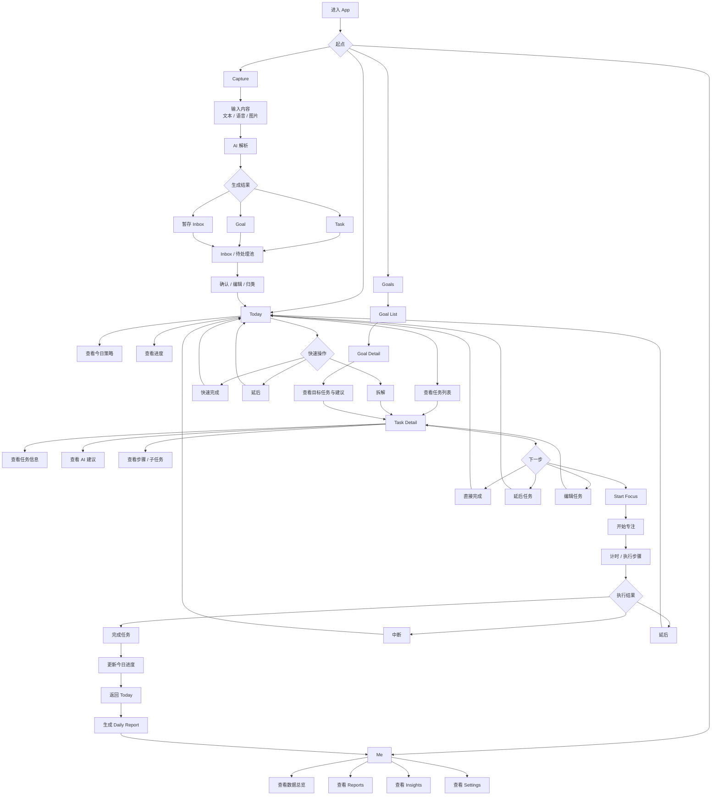
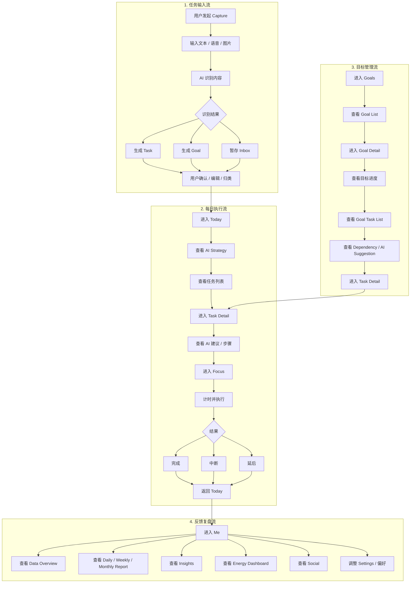

# Chronos App 产品信息架构（最终版 / 含分期标注）

## 一、产品顶层结构

### 全局层
- `Capture` `[P1]`
  - 文本输入
  - 语音输入
  - 图片输入
  - 快速创建 Task
  - 快速创建 Goal
- `Inbox / 待处理池` `[P1]`
  - 待确认输入
  - 待归类任务
  - 待关联 Goal
- `AI Agent` `[P1-P4]`
  - Task / Goal 自动解析 `[P1]`
  - 优先级判断 `[P1]`
  - Rolling Plan 调度 `[P1]`
  - 洞察生成 `[P2]`
  - 自动提醒 `[P3]`
  - 多人任务分配 `[P4]`
- `Notification / Reminder` `[P3-P4]`
  - 执行提醒 `[P3]`
  - 截止提醒 `[P3]`
  - 小组提醒 `[P4]`

### 底部导航（Tab）
1. `Today` `[P1]`
2. `Goals` `[P2]`
3. `Me` `[P1]`

> `Focus` 不作为 Tab，作为任务执行态二级页存在  
> `Task Detail` 不作为一级导航，作为 Today / Goals 的中间承接页存在

---

## 二、页面级信息架构

## 1. Today（首页 / AI 调度中心）`[P1]`

### 页面定位
- 每日任务调度中心
- AI 输出今日推荐执行顺序
- 用户完成快速操作与进入执行态的核心入口

### 页面结构
- `Header`
  - 日期
  - 问候语
  - 今日精力状态 `[P2]`
  - Capture 入口
  - 提醒入口 `[P3]`

- `AI Strategy Card`
  - 今日策略摘要
  - 高价值优先提示
  - 轻量模式 / 冲刺模式提示
  - AI 调度说明 `[P2]`

- `Task List（核心）`
  - 高优先级任务（Pinned）
  - 推荐执行序列（AI 排序）
  - 低优先级任务（折叠）
  - 被滚动到未来的任务提示 `[P2]`

- `Progress`
  - 今日完成进度
  - 今日 Focus 时长 `[P1]`
  - 高价值任务完成率 `[P2]`

- `Quick Actions`
  - 完成
  - 延后
  - 拆解
  - 重新安排 `[P2]`

- `Today Insights Preview` `[P2]`
  - 今日风险提醒
  - 剩余时间建议
  - AI 调整建议

### 可进入页面
- `Task Detail`
- `Capture`
- `Daily Report` `[P1]`
- `Strategy Detail` `[P2]`
- `Reminder Center` `[P3]`

---

## 2. Task Detail（任务详情页 / 中间承接层）`[P1]`

> `Focus` 的入口页，也是从 AI 决策走向执行的过渡层

### 页面结构
- `Basic Info`
  - 标题
  - 所属 Goal
  - 截止时间
  - 来源 `[P3]`
    - 手动创建
    - 语音输入
    - 图片识别
    - 邮件 / 日程生成

- `AI Info`
  - 推荐时长
  - 优先级
  - 执行建议
  - 推荐执行时段 `[P2]`
  - 滞后风险 `[P2]`

- `Progress`
  - 当前进度
  - 当前状态

- `Subtasks / Steps`
  - 子任务列表
  - 执行步骤
  - AI 拆解建议 `[P2]`

- `Dependency` `[P2]`
  - 前置任务
  - 后续任务

- `Related Context` `[P3]`
  - 关联 Goal
  - 关联日程
  - 关联邮件
  - 关联碎片想法

- `Actions`
  - `Start Focus`
  - 完成
  - 延后
  - 调整优先级 `[P2]`
  - 编辑任务 `[P1]`

### 可进入页面
- `Focus`
- `Goal Detail` `[P2]`
- `Task Edit`

---

## 3. Focus（执行页 / 二级页）`[P1]`

### 进入路径
`Today → Task Detail → Focus`  
`Goals → Task Detail → Focus`

### 页面定位
- 单任务专注执行场景
- 尽量减少信息干扰
- 记录执行时长与过程反馈

### 页面结构
- `Current Task`
  - 任务标题
  - Goal 标签
  - 当前步骤

- `Timer`
  - 正计时
  - 番茄钟
  - 推荐剩余时长 `[P2]`

- `Execution Steps`
  - 子步骤列表
  - 当前步骤勾选

- `Status Feedback`
  - 动画反馈 `[P2]`
  - 吉祥物反馈 `[P4]`
  - 轻量激励提示 `[P2]`

- `Actions`
  - 完成
  - 中断
  - 延后
  - 标记部分完成 `[P2]`

- `Mini Insight` `[P2]`
  - 是否建议休息
  - 是否建议切换轻量任务

---

## 4. Goals（目标系统）`[P2]`

### 页面定位
- 中长期目标管理中心
- 承载目标拆解、任务归属、目标推进反馈

### Goals 首页结构
- `Goal List`
  - 标题
  - 进度
  - Deadline
  - 风险状态
  - 关联任务数

- `Goal Filters`
  - 进行中
  - 即将截止
  - 已完成
  - 高价值目标

- `Goal Summary`
  - 总目标数
  - 本周推进情况

### Goal Detail 结构
- `Goal Overview`
  - 标题
  - 描述
  - Deadline
  - 价值等级

- `Goal Progress`
  - 总体完成率
  - 关键节点
  - 当前滞后情况

- `Goal Task List`
  - 未完成任务
  - 已完成任务
  - 推荐下一步任务

- `Dependency Map`
  - 任务依赖关系
  - 阶段顺序

- `AI Suggestion`
  - 拆解建议
  - 目标优化建议
  - 风险预警

- `Goal Actions`
  - 添加任务
  - 调整目标
  - 标记完成

### 可进入页面
- `Task Detail`
- `Goal Edit`
- `Dependency View`

---

## 5. Me（我的）`[P1]`

> 收敛：个人信息、数据反馈、洞察、设置  
> 社交与健康模块先作为入口保留，按分期逐步增强

### 页面结构
- `Profile`
  - 头像 / 名字
  - 连续使用
  - 成就 / 里程碑 `[P2]`

- `Data Overview`
  - 今日完成率
  - 本周专注时间
  - Goal 完成情况 `[P2]`

- `Insights` `[P2]`
  - AI 洞察卡片
  - 行为趋势
  - 精力曲线
  - 高低效时段分析

- `Energy` `[P3]`
  - 睡眠
  - 压力
  - 精力预测结果

- `Social Entry` `[P4]`
  - 小组
  - 好友
  - 点赞互动入口

- `Reports`
  - Daily Report `[P1]`
  - Weekly Report `[P2]`
  - Monthly Report `[P2]`

- `Settings`
  - 通知设置 `[P1]`
  - 数据接入 `[P3]`
    - 日历
    - 邮件
    - 健康
  - AI 策略偏好 `[P2]`
  - Focus 模式设置 `[P1]`

### 可进入页面
- `Daily Report` `[P1]`
- `Weekly Report` `[P2]`
- `Monthly Report` `[P2]`
- `Insight Detail` `[P2]`
- `Energy Dashboard` `[P3]`
- `Social` `[P4]`
- `Settings`

---

## 三、辅助系统信息架构

## 1. Capture System（统一输入层）`[P1-P3]`

### 结构
- `Input Mode Selector`
  - 文本 `[P1]`
  - 语音 `[P3]`
  - 图片 `[P3]`

- `Parsing Result`
  - 识别为 Task `[P1]`
  - 识别为 Goal `[P1]`
  - 识别为日程事项 `[P3]`
  - 识别为碎片想法 `[P3]`

- `User Confirmation`
  - 确认生成 Task
  - 确认生成 Goal
  - 关联到已有 Goal `[P2]`
  - 暂存到 Inbox `[P1]`

- `Post Processing`
  - AI 自动分类 `[P1]`
  - AI 估算时长 `[P1]`
  - AI 建议优先级 `[P1]`
  - 自动映射来源内容 `[P3]`

---

## 2. Reports & Insights System（复盘反馈层）`[P1-P3]`

### Daily Report `[P1]`
- 完成任务数
- Focus 时长
- 延后 / 中断记录
- AI 每日建议

### Weekly Report `[P2]`
- 每日趋势
- 高价值任务推进情况
- 滞后任务分析
- 专注时长总量

### Monthly Report `[P2]`
- Goal 完成趋势
- 长期行为模式
- 策略优化建议

### Insight Detail `[P2]`
- 行为模式分析
- 高低效时段判断
- 任务安排优化建议
- 滚动策略解释

### Energy Dashboard `[P3]`
- 睡眠趋势
- 压力趋势
- 精力曲线
- 精力与任务匹配建议

---

## 3. Social System（轻社交与协作扩展层）`[P4]`

### 结构
- `Friends`
  - 好友列表
  - 状态卡
  - 点赞互动

- `Groups`
  - 小组列表
  - 小组目标
  - 成员状态
  - 小组任务推进

- `Team Reminder`
  - 重要事项提醒
  - 协作任务提醒

- `Ranking / Milestone`
  - 小组成就
  - 里程碑展示

---

## 4. Energy & Health System（精力辅助层）`[P3]`

### 结构
- `Energy Summary`
  - 今日精力状态
  - 精力预测

- `Sleep`
  - 睡眠时长
  - 睡眠质量

- `Stress`
  - 压力指数
  - 压力趋势

- `Energy Insight`
  - 高效时段判断
  - 任务类型建议

> 该模块主要服务 `Today` 的 AI 排序与 `Me` 的洞察反馈，不单独作为一级导航

---

## 四、核心用户路径

### 主路径（执行闭环）`[P1]`
`Capture → Inbox → Today → Task Detail → Focus → 完成 → Today → Daily Report`

### 快速路径（轻操作）`[P1]`
`Today → 快速完成 / 延后`

### 目标路径 ` [P2]`
`Goals → Goal Detail → Task Detail → Focus`

### 复盘路径 `[P1-P2]`
`Today / Me → Daily Report / Weekly Report / Monthly Report`

### 洞察路径 `[P2]`
`Me → Insights → Insight Detail`

### 精力路径 `[P3]`
`Me → Energy Dashboard`

### 协作路径 `[P4]`
`Me → Social → Group / Friend Detail`

---

## 五、交互流程图

### 1. 主交互闭环图

### 2. 分角色交互流程图

---

## 六、分期建议

### Phase 1（P1）核心闭环上线
- `Capture`
- `Inbox / 待处理池`
- `Today`
- `Task Detail`
- `Focus`
- `Me（基础数据）`
- `Daily Report`
- 基础 AI 调度
- 基础任务创建、完成、延后、拆解

### Phase 2（P2）目标与洞察增强
- `Goals`
- `Goal Detail`
- `Weekly Report`
- `Monthly Report`
- `Insight Detail`
- `AI Strategy Detail`
- 任务依赖
- 高价值任务分析
- 滚动策略解释

### Phase 3（P3）自然生长模块接入
- 语音输入
- 图片输入
- 日历接入
- 邮件接入
- 睡眠 / 压力数据接入
- `Energy Dashboard`
- 自动提醒增强
- 来源内容关联

### Phase 4（P4）轻社交与协作扩展
- `Friends`
- `Groups`
- `Team Reminder`
- 点赞互动
- 小组目标推进
- AI 多人任务分配
- 吉祥物增强反馈

---

## 七、设计原则

- `Today` = 决策中心（AI 输出）
- `Task Detail` = 行为承接层
- `Focus` = 执行场景
- `Goals` = 中长期方向管理
- `Me` = 数据反馈与设置收敛
- `Capture` = 全局输入入口
- `Inbox` = 输入与调度之间的缓冲层

---

## 八、一句话总结

`Capture（输入）→ Inbox（整理）→ Today（决策）→ Task Detail（承接）→ Focus（执行）→ Me / Reports（反馈）`
