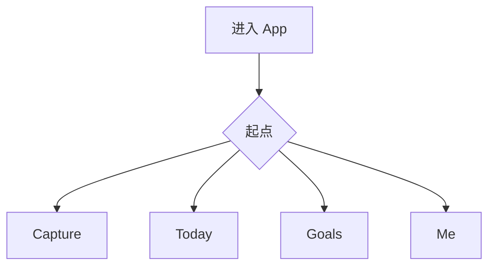
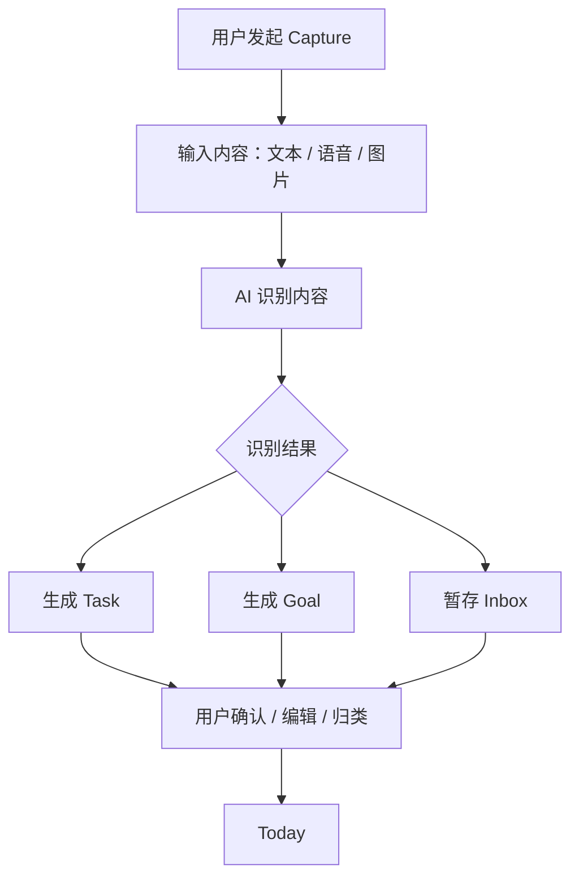
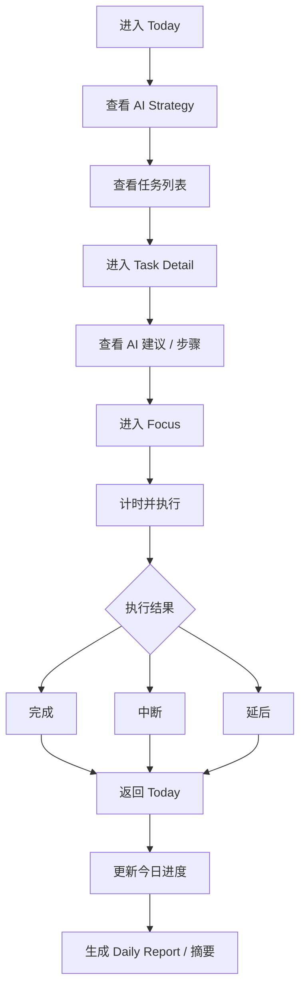
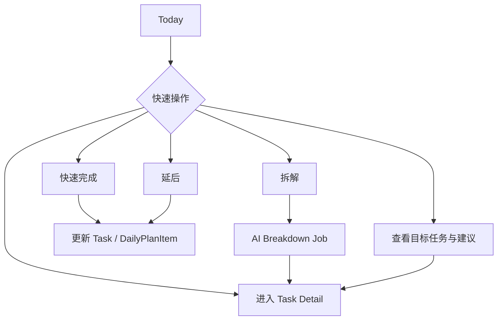
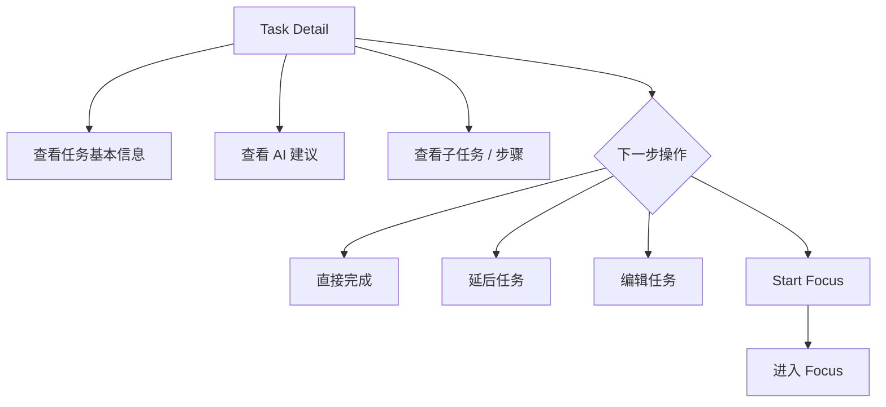
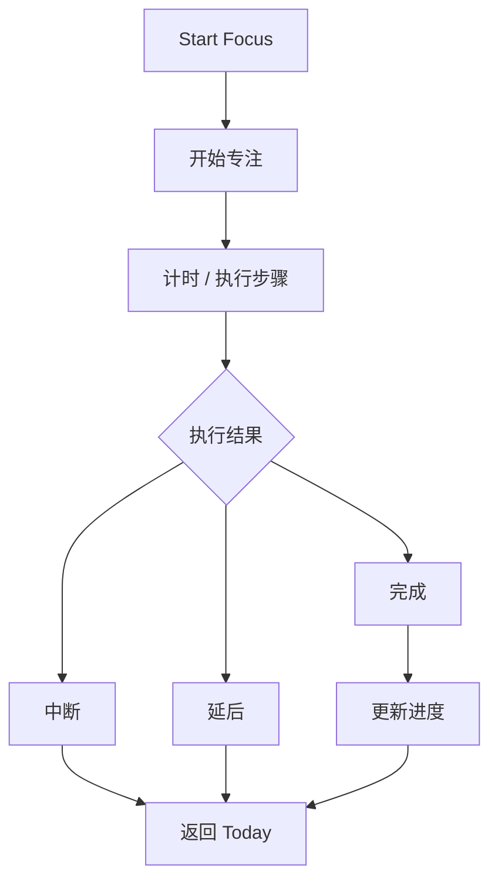
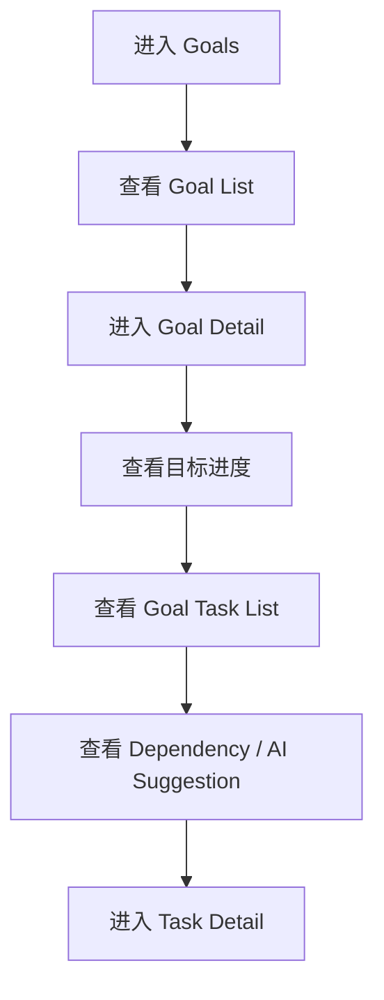
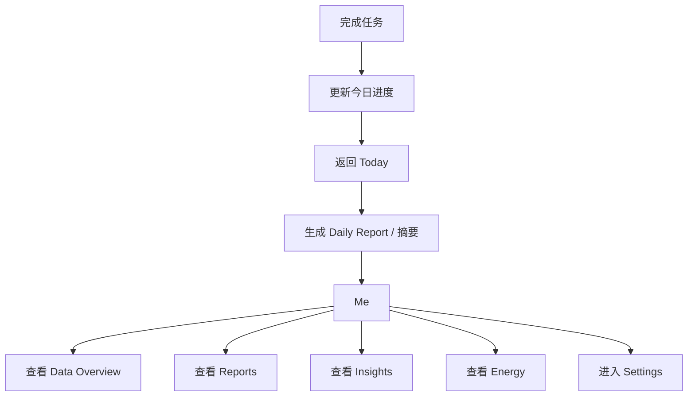

# Chronos Interaction Flow Design

> 本文沉淀 Chronos 的交互流程设计，用于连接产品信息架构、页面跳转、后端业务模块和事件模型。  
> 本文以当前交互流程图为依据，将视觉流程转写为可执行的开发说明。

---

## 1. 交互设计总览

Chronos 的核心交互不是围绕“管理任务列表”，而是围绕“让用户从输入走向执行，再回到反馈”。

主闭环：

```text
进入 App
-> Capture / Today / Goals / Me
-> Capture 输入
-> AI 解析
-> Inbox / Task / Goal
-> 用户确认
-> Today
-> Task Detail
-> Focus
-> 完成 / 中断 / 延后
-> 返回 Today
-> Daily Report / Me
```

产品交互的核心判断：

```text
用户能否从一个模糊输入，
自然进入一个明确的今日行动，
并在执行后形成反馈。
```

---

## 2. 全局起点

用户进入 App 后，可以从多个入口开始：

- Capture
- Today
- Goals
- Me

P1 的默认主入口是 Today，但 Capture 作为全局输入入口始终可达。



后端含义：

- Today 需要提供稳定的首页聚合接口。
- Capture 需要可以从任意位置创建输入。
- Me 需要提供基础数据总览和设置入口。
- Goals 在 P1 只保留轻量能力，P2 才成为完整路径。

---

## 3. 任务输入流

任务输入流负责把用户的模糊输入转成可确认的结构化对象。

P1 主路径：

```text
用户发起 Capture
-> 输入文本
-> AI 识别内容
-> 生成识别结果
-> 生成 Task / 生成 Goal / 暂存 Inbox
-> 用户确认 / 编辑 / 归类
-> 进入 Today
```

P3 扩展输入：

- 语音输入
- 图片输入
- 邮件接入
- 日历接入
- 睡眠 / 压力等自然生长模块



后端含义：

- `CaptureInput` 保存原始输入。
- `AIParseResult` 保存 AI 解析结果。
- `InboxItem` 作为 AI 输出和正式任务库之间的缓冲。
- 低置信度结果进入 Inbox，不直接进入正式 Task / Goal。
- 用户确认、编辑、丢弃都写入 `ActivityEvent`。

对应接口：

```text
POST /api/v1/captures
GET  /api/v1/inbox
PATCH /api/v1/inbox/{item_id}
POST /api/v1/inbox/{item_id}/confirm
POST /api/v1/inbox/{item_id}/discard
GET  /api/v1/ai-jobs/{job_id}
```

---

## 4. 每日执行流

每日执行流是 P1 的核心。

```text
进入 Today
-> 查看 AI Strategy
-> 查看任务列表
-> 进入 Task Detail
-> 查看 AI 建议 / 步骤
-> 进入 Focus
-> 计时并执行
-> 完成 / 中断 / 延后
-> 返回 Today
-> 更新今日进度
-> 生成 Daily Report
```



后端含义：

- Today 不是实时任务列表，而是 `DailyPlan` 快照。
- Today 的任务顺序来自 `DailyPlanItem`。
- AI 策略摘要来自 `StrategySnapshot`。
- Replan 或用户调整创建 `PlanRevision`。
- Focus 操作写入 `FocusSession` 和 `ActivityEvent`。
- Daily Report 基于 `ActivityEvent`、`FocusSession`、`DailyPlan` 汇总。

对应接口：

```text
GET  /api/v1/today
POST /api/v1/today/replan
GET  /api/v1/tasks/{task_id}
POST /api/v1/focus-sessions
POST /api/v1/focus-sessions/{session_id}/complete
POST /api/v1/focus-sessions/{session_id}/interrupt
POST /api/v1/focus-sessions/{session_id}/postpone
GET  /api/v1/reports/daily/{date}
```

---

## 5. Today 快速操作流

Today 提供轻操作，避免用户每次都进入深层页面。

可操作项：

- 快速完成
- 延后
- 查看目标任务与建议
- 拆解
- 查看任务列表
- 进入 Task Detail



后端含义：

- 快速完成和延后必须更新 Task 当前状态。
- 同时写入 `ActivityEvent`。
- 如果任务在当前 DailyPlan 中，也要同步更新 `DailyPlanItem`。
- 拆解可以异步执行，返回 `AIJob`。

---

## 6. Task Detail 到 Focus 流

Task Detail 是 Today / Goals 到 Focus 的中间承接层。

它帮助用户在进入执行前确认：

- 任务基本信息
- 所属 Goal
- AI 建议
- 子任务 / 步骤
- 下一步动作

可选动作：

- 直接完成
- 延后任务
- 编辑任务
- Start Focus



后端含义：

- `GET /tasks/{id}` 只返回执行前必要信息。
- 历史事件、来源上下文、复杂策略解释不默认返回。
- 操作都写入 `ActivityEvent`。

---

## 7. Focus 执行流

Focus 是执行态，不是控制面板。

```text
Start Focus
-> 开始专注
-> 计时 / 执行步骤
-> 执行结果
-> 完成 / 中断 / 延后
```



后端含义：

- `FocusSession` 记录开始、结束、状态和实际时长。
- 完成、中断、延后都要写入 `ActivityEvent`。
- 完成后更新 Task progress / status。
- 如果任务属于今日计划，同步更新 DailyPlan progress。

P1 范围：

- start
- complete
- interrupt
- postpone

P1 暂不做：

- 复杂 pause/resume
- Focus 内复杂洞察
- 大量统计图
- 重度激励系统

---

## 8. 目标管理流

Goals 在产品中是 P2 目标系统，但 P1 需要 Light Goal 作为任务归属。

P2 目标路径：

```text
进入 Goals
-> 查看 Goal List
-> 进入 Goal Detail
-> 查看目标进度
-> 查看 Goal Task List
-> 查看 Dependency / AI Suggestion
-> 进入 Task Detail
```



P1 后端边界：

- 支持创建 Goal。
- 支持 Task 关联 Goal。
- 支持 Goal selector 轻量列表。
- 不实现完整 Goal Detail 聚合。
- 不实现 Dependency Map。

P2 后端扩展：

- Goal Progress（已支持）
- Goal Progress Timeline（已支持）
- Goal Task List（已支持）
- Dependency（已支持任务依赖边）
- Goal AI Suggestion（已支持规则版）
- 高价值目标分析

---

## 9. 反馈复盘流

反馈流收敛到 Me / Reports。

```text
完成任务
-> 更新今日进度
-> 返回 Today
-> 生成 Daily Report / 摘要
-> 进入 Me
-> 查看 Data Overview / Reports / Insights / Energy / Settings
```



P1：

- Daily Report
- Me 基础数据
- Settings 基础入口

P2：

- Weekly Report
- Monthly Report
- Insights
- 高价值分析

P3：

- Energy Dashboard
- 睡眠 / 压力

P4：

- Social
- Groups / Friends

---

## 10. 分期交互边界

### P1 核心闭环

```text
Capture -> Inbox -> 基础 AI 调度 -> Today -> Task Detail -> Focus -> Daily Report -> Me
```

P1 必须保证：

- 输入可被整理。
- 今日任务可被编排。
- 用户可以进入执行。
- 执行结果可以反馈。
- DailyPlan / ActivityEvent / FocusSession / DailyReport 能形成数据闭环。

### P2 目标与洞察

```text
Goals -> Goal Detail -> Task Detail -> Focus
Me -> Insights -> Insight Detail
Today -> Strategy Detail
```

### P3 自然生长模块

```text
语音 / 图片 / 邮件 / 日历 / 睡眠压力
-> 来源内容关联
-> Today 编排
-> Me / Energy Dashboard
```

### P4 轻社交与协作

```text
Me -> Social -> Friends / Groups
Groups -> Team Reminder / 小组目标推进 / AI 多人任务分配
```

---

## 11. 交互到后端对象映射

| 交互节点 | 后端对象 | 说明 |
| --- | --- | --- |
| Capture 输入 | `CaptureInput` | 保存原始输入 |
| AI 解析 | `AIJob`, `AIParseResult` | 异步解析和结构化输出 |
| Inbox 确认 | `InboxItem`, `ActivityEvent` | 用户确认前的缓冲层 |
| 生成 Task | `Task`, `TaskStep` | 正式任务实体 |
| 生成 Goal | `Goal` | P1 轻量目标 |
| Today | `DailyPlan`, `DailyPlanItem` | 今日计划快照 |
| AI Strategy | `StrategySnapshot` | 策略摘要和解释元数据 |
| Replan | `PlanRevision`, `ActivityEvent` | 计划版本变化 |
| Task Detail | `Task`, `TaskStep`, `Goal` | 执行前承接信息 |
| Focus | `FocusSession`, `ActivityEvent` | 执行行为采集 |
| 完成 / 中断 / 延后 | `ActivityEvent` | 行为事实记录 |
| Daily Report | `DailyReport` | 当日反馈快照 |
| Me Overview | 聚合查询 | 基础数据总览 |

---

## 12. 交互设计对开发的要求

1. 页面接口要服务交互，不要把数据库表直接暴露给前端。
2. Today 必须是聚合视图，返回行动序列和轻量策略摘要。
3. Task Detail 必须克制，只返回进入执行所需信息。
4. Focus API 必须简单，不混入复杂分析。
5. 用户每个关键操作都要形成 ActivityEvent。
6. AI 异步任务必须能被前端查询状态。
7. P1 以闭环跑通为验收，不以功能数量为验收。

---

## 13. 一句话总结

```text
Chronos 的交互设计不是让用户管理更多东西，
而是让用户从输入、决策、执行到反馈，
顺着一条清晰路径自然往前走。
```
