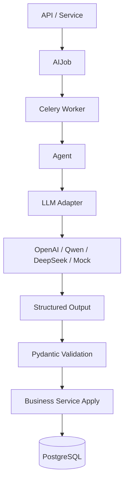

# Chronos LLM & Agent Architecture

> 本文定义 Chronos 的 LLM 接入方式、Agent 职责、AIJob 生命周期、结构化输出和降级策略。  
> 目标是让 AI 能增强每日执行闭环，但不破坏 Chronos 的克制、可信和用户控制感。

---

## 1. 设计目标

Chronos 的 AI 不是一个直接操纵业务数据的黑箱，而是一个可追踪、可降级、可替换的后台智能层。

核心目标：

- 支持 OpenAI / Qwen / DeepSeek 等不同模型供应商。
- 所有 AI 任务都可追踪、可失败、可重试。
- 所有 LLM 输出都必须结构化校验。
- 核心闭环不能因为 LLM 不可用而中断。
- 用户始终保留修正权和控制感。

核心原则：

```text
LLM 只产生结构化建议，
业务 service 决定如何落库。
```

---

## 2. 总体调用链路

```text
API / Service
-> create AIJob
-> Celery Worker
-> Agent
-> LLM Adapter
-> Structured Output
-> Schema Validation
-> Service Apply
-> DB Write
```



关键约束：

- API 不直接调用 LLM。
- Service 不绑定具体 LLM provider。
- Worker 负责执行和状态更新。
- Agent 负责具体 AI 任务逻辑。
- Adapter 负责模型供应商差异。
- Service 负责最终业务写入。

---

## 3. 推荐目录结构

```text
app/
  ai/
    client.py
    config.py

    providers/
      base.py
      openai.py
      qwen.py
      deepseek.py
      mock.py

    schemas/
      capture.py
      planning.py
      breakdown.py
      task_semantic_planning.py
      report.py

    prompts/
      capture_parser.md
      daily_planner.md
      task_semantic_planning.md
      task_breakdown.md
      daily_report.md

  workers/
    tasks.py
    agents/
      capture_parser.py
      daily_planner.py
      task_breakdown.py
      daily_report_generator.py
```

---

## 4. Provider Adapter 设计

业务代码不应该直接依赖 OpenAI、Qwen 或 DeepSeek SDK。

推荐抽象：

```python
from dataclasses import dataclass
from typing import Any, Generic, Protocol, TypeVar
from pydantic import BaseModel

T = TypeVar("T", bound=BaseModel)

@dataclass(frozen=True)
class LLMStructuredGeneration(Generic[T]):
    output: T
    usage: dict[str, Any]
    response_id: str | None = None
    raw_metadata: dict[str, Any] | None = None

class LLMProvider(Protocol):
    def generate_structured(
        self,
        *,
        prompt: str,
        schema: type[T],
        temperature: float = 0.2,
        metadata: dict | None = None,
    ) -> LLMStructuredGeneration[T]:
        ...
```

Provider 职责：

- 调用具体模型。
- 尽量使用模型原生 structured output / JSON mode。
- 返回 Pydantic schema 实例和轻量运行观测信息。
- 抛出统一异常。

不属于 Provider 的职责：

- 不写数据库。
- 不创建 Task / DailyPlan。
- 不判断业务状态机。
- 不处理用户权限。

---

## 5. LLM 配置

推荐 `.env` 配置：

```env
AI_ENABLE_REAL_LLM=false

LLM_PROVIDER=mock
LLM_MODEL=structured-mock-v1
LLM_API_KEY=
LLM_BASE_URL=

LLM_FALLBACK_PROVIDER=mock
LLM_TIMEOUT_SECONDS=30
LLM_MAX_RETRIES=2
LLM_ALLOWED_PROVIDERS=openai,openai-compatible
LLM_ALLOWED_MODELS=gpt-4.1-mini
LLM_MAX_OUTPUT_TOKENS=800
```

P1 默认建议：

```text
AI_ENABLE_REAL_LLM=false
```

当前默认：

- `AI_ENABLE_REAL_LLM=false`
- Daily Planner 使用 mock provider 和 structured output shell。
- Planning Engine v1 仍是最终排序和 fallback 核心。
- Task Semantic Planning Agent 已提供任务语义信号，但不直接排序；Planning Engine 负责把它转成 `semantic_*` 分项。
- 已提供 OpenAI-compatible provider adapter；只有 `AI_ENABLE_REAL_LLM=true` 时才会被 registry 选中。
- 真实 provider 不能绕过业务层校验和用户确认边界。

真实 provider 示例：

```env
AI_ENABLE_REAL_LLM=true
LLM_PROVIDER=openai
LLM_MODEL=gpt-4.1-mini
LLM_API_KEY=...
LLM_BASE_URL=
LLM_FALLBACK_PROVIDER=mock
LLM_ALLOWED_PROVIDERS=openai
LLM_ALLOWED_MODELS=gpt-4.1-mini
LLM_MAX_OUTPUT_TOKENS=800
```

真实 provider smoke 必须手动显式允许，默认不发网络请求：

```bash
uv run python scripts/smoke_llm_provider.py
AI_ENABLE_REAL_LLM=true LLM_PROVIDER=openai LLM_MODEL=gpt-4.1-mini LLM_ALLOWED_MODELS=gpt-4.1-mini LLM_API_KEY=... uv run python scripts/smoke_llm_provider.py --allow-real-llm
uv run python scripts/smoke_daily_planner_fallback.py
uv run python scripts/generate_llm_acceptance_dry_run.py --date 2026-05-17
```

真实 provider 验收记录：

```text
docs/llm-provider-acceptance/TEMPLATE.md
```

每次真实 provider 验收都应记录 provider、model、prompt version、prompt checksum、usage、latency、provider response id 摘要、task id preservation 明细、Daily Planner fallback smoke、planner eval JSONL compare 结果、golden policy check 结果和最终结论。记录中不能包含 API key、真实用户输入或 provider 原始敏感响应。

真实 provider 保护边界：

- `LLM_ALLOWED_PROVIDERS` 限制可发起真实请求的 provider。
- `LLM_ALLOWED_MODELS` 限制可发起真实请求的 model；OpenAI-compatible 自定义模型必须显式加入。
- `LLM_MAX_OUTPUT_TOKENS` 为真实 structured output 调用设置输出上限。
- provider / model / token guard 失败时，Daily Planner 走 Planning Engine fallback，并在 AIJob 中记录 provider error。

---

## 6. AIJob 生命周期

所有异步 AI 任务必须对应一条 `AIJob`。

状态机：

```text
queued -> running -> succeeded
queued -> running -> failed
queued -> running -> succeeded_with_fallback
failed -> queued
running -> canceled
```

字段建议：

```text
AIJob {
  id
  user_id
  job_type
  status
  input_entity_type
  input_entity_id
  result_entity_type
  result_entity_id
  celery_task_id
  provider
  model
  prompt_version
  latency_ms
  error_message
  retry_count
  metadata
  started_at
  finished_at
  created_at
  updated_at
}
```

职责：

- 前端可以查询 AI 任务状态。
- 失败可以展示简短错误。
- 用户可以触发 retry。
- 后端可以审计 AI 执行历史。

状态语义：

- `succeeded`：LLM 正常完成，结果通过 schema validation。
- `succeeded_with_fallback`：LLM 调用失败或输出无效，但系统已使用 fallback 生成可用结果。
- `failed`：LLM 和 fallback 都未能产生可用结果，或任务不应自动降级。
- `canceled`：任务被取消，不再应用结果。

对应接口：

```text
GET  /api/v1/ai-jobs/{job_id}
POST /api/v1/ai-jobs/{job_id}/retry
```

---

## 7. 核心 Agent 设计

当前优先服务 Capture -> Inbox -> Today -> Task Detail -> Focus -> Report 主线，先实现低风险、可解释、可回退的核心 Agent。

### 7.1 Capture Parser

目的：

```text
把用户输入解析成候选 Task / Goal / InboxItem。
```

输入：

- CaptureInput
- 用户文本
- 可选上下文：已有 Goal 列表

输出：

- AIParseResult
- InboxItem

规则：

- 低置信度结果进入 Inbox。
- 不直接创建正式 Task / Goal。
- 用户确认后再由 InboxService 创建正式对象。

当前实现状态：

- 已接入 `CaptureParserAgent`，使用 prompt registry 中的 `p2-capture-parser-agent-v1`。
- 创建 Capture 时同步创建 `AIJob(job_type=capture_parser)`，记录 provider、model、prompt version、prompt checksum、latency、usage 和 fallback 信息。
- 默认 mock provider 使用 rule parser 输出作为 `mock_output`，保证本地不依赖真实 LLM。
- Agent 输出只写入 `AIParseResult` 和 `InboxItem`，`AIJob.result_entity` 指向 InboxItem。
- Agent / provider 失败或输出不合法时，使用 rule parser fallback，并标记 `AIJob.status=succeeded_with_fallback`。

建议输出 schema：

```python
from datetime import date
from typing import Literal
from pydantic import BaseModel, Field

class CaptureParserOutput(BaseModel):
    result_type: Literal["task", "goal", "idea", "calendar_item", "unknown"]
    item_type: Literal["task", "goal", "idea", "unknown"]
    title: str
    description: str | None = None
    estimated_duration_min: int | None = None
    suggested_priority: int | None = None
    suggested_deadline: date | None = None
    confidence: float = Field(ge=0, le=1)
    rationale: str | None = None
```

失败 fallback：

- 使用 rule parser 结果生成 `AIParseResult` 和 `InboxItem`。
- 如果 rule parser 也无法判断，则 `item_type = unknown`。
- `AIJob.status = succeeded_with_fallback`
- 用户仍可手动确认 / 编辑。

### 7.2 Daily Planner

目的：

```text
生成今日推荐执行顺序和策略摘要。
```

当前实现状态：

- 已落地 Planning Engine v1，作为 deterministic planner core 和未来 LLM Daily Planner 的 fallback。
- Planning Engine v1 已读取任务价值、Goal 价值、Goal 下一步保护、Goal 完成率 / 剩余任务 / 截止压力、任务 / Goal deadline、优先级、剩余估时、依赖、用户修正、真实执行反馈、当日容量、Energy 信号、TaskPlanningSignal 语义信号和基于同类语义任务历史的个人执行画像。
- 已接入 Daily Planner Agent critique / suggestion：`PlanningService` 先生成 deterministic candidates，再调用 Agent 返回 structured review。
- Today 可通过 `POST /api/v1/today/planning-signals` 受控生成当前主序列缺失的 TaskPlanningSignal；生成后仍由 deterministic Planning Engine replan，不由 LLM 直接排序。
- 默认 provider 是 `mock`，模型标识为 `structured-mock-v1`；`AI_ENABLE_REAL_LLM=false` 时不会调用外部模型。
- 已接入 OpenAI-compatible provider adapter，可通过 `LLM_PROVIDER=openai` 或 `LLM_PROVIDER=openai-compatible` 显式启用；本地和 CI 默认关闭。
- 每次 plan revision 都记录一条 `AIJob(job_type=daily_planner)`，Strategy Detail `source.ai_job_id` 可追踪调用结果。
- Daily Planner prompt 已迁移到 `app/ai/prompts/daily_planner/p2-daily-planner-agent-v1.md`，通过 prompt registry 加载，并在 `AIJob.job_metadata.prompt_checksum` 里记录 checksum。
- Daily Planner provider 调用记录 `latency_ms`、`provider_latency_ms`、`failure_type`、`provider_response_id` 和 `usage`；真实 provider 返回 usage 时会写入 token 统计，mock / fallback 保持空结构。
- v1 只允许 Agent 更新策略摘要、推荐理由和 Strategy Detail 的 `planner_review`；业务层校验禁止 Agent 改变任务集合、排序和 section。
- Agent 失败或输出不合法时，`AIJob.status=succeeded_with_fallback`，继续使用 Planning Engine v1 输出。
- 每个 `DailyPlanItem` 会保存 `score_breakdown`，包含 `score_version`、`score_band` 和各项评分因子；Strategy Detail 会再归纳出 `score_explanation`、`dominant_factor`、`dominant_reason` 和 `score_signals`，前端不需要自行解释原始权重。
- 超出容量的非保护任务进入 `section=rolled_over`；系统容量滚动不把 Task 本体改为 postponed。
- 已提供 `scripts/evaluate_planning_engine.py` 固定场景评估，覆盖容量滚动、受保护任务超载、低精力保护、高精力深度任务适配、依赖链保护、用户手动优先级修正、重复中断行为反馈、多 Goal 竞争和超期 Goal 恢复；支持 `--jsonl-output` 写出 run summary 和 scenario records。
- 已提供 `scripts/compare_planner_eval_jsonl.py` 比较两次 planner eval JSONL，默认只报告 scenario 通过状态、排序和 `item_signals` 差异；显式加 `--fail-on-regression` 时才作为回归 gate。
- 已提供 planner eval golden baseline policy：`docs/planner-eval-baselines/p2-planning-engine-eval-v6.json` 和 `scripts/check_planner_eval_policy.py`。后续 LLM Daily Planner 必须通过这些基线、用 compare / policy 工具说明差异，或显式更新评估预期。
- 已提供 `scripts/generate_llm_acceptance_dry_run.py`，用于在不调用真实 provider 的情况下跑通 provider smoke / fallback / compare / policy 到验收草稿的完整流程。
- 已提供 `scripts/generate_llm_acceptance_record.py`，用于把真实 provider smoke、fallback smoke、planner eval compare 和 golden policy check 的 JSON 输出生成 Markdown 验收草稿；默认脱敏 provider response id，生成后仍需人工 review。

输入：

- 未完成任务
- Light Goal 信息
- 用户设置
- 今日已有 DailyPlan
- 最近 ActivityEvent
- 可选精力状态

输出：

- DailyPlan
- DailyPlanItem
- StrategySnapshot
- PlanRevision

说明：

- `PlanRevision` 由 PlanningService 根据触发来源创建。
- LLM 不直接输出完整 revision，也不直接修改当前 DailyPlan。
- LLM 输出的是策略摘要、推荐理由、审阅总结和轻量建议；版本号、diff、排序和落库由业务 service 负责。

建议输出 schema：

```python
from typing import Literal
from pydantic import BaseModel

class PlanItemOutput(BaseModel):
    task_id: str
    section: Literal["pinned", "recommended", "low_priority", "rolled_over"]
    sort_order: int
    recommendation_reason: str
    score_breakdown: dict | None = None

class DailyPlanOutput(BaseModel):
    mode: Literal["light", "normal", "sprint"]
    strategy_summary: str
    primary_reason: str
    items: list[PlanItemOutput]
    review_summary: str | None = None
    suggestions: list[PlannerSuggestionOutput] = []
```

`suggestions` 只用于 Strategy Detail 的二级解释，不进入 Today 首屏，不代表系统已经修改计划。

重要原则：

```text
P1 不建议完全依赖 LLM 排序。
```

推荐策略：

- Planning Engine v1 负责确定性基础顺序、容量筛选、`score_breakdown` 和 fallback。
- LLM 后续只增强策略摘要、推荐理由、审阅建议、异常场景判断和可解释性，不直接写业务表。
- Service 负责校验 LLM 输出是否违反依赖、容量和用户修正边界。
- Planner 相关改动应优先更新固定评估场景，避免“接口通过但排序退化”。

Planning Engine v1 已使用的信号：

- deadline
- priority
- value_level
- estimated_duration
- 是否多次延后
- 是否属于高价值目标
- Goal deadline / 超期 Goal 恢复
- 今日已完成 / 中断情况
- task dependencies
- user priority adjustment
- daily capacity
- EnergyDailyMetric
- TaskPlanningSignal：任务类型、复杂度、认知负荷、语义估时、目标对齐、阻塞风险、最小可推进步骤
- Goal progress strategy：基于 Goal 当前完成率、剩余任务数、截止压力和价值等级，只提升目标当前下一步，不把 Today 扩展成项目管理看板。
- Personalization signal：基于 `TaskPlanningSignal.task_type` 聚合同类历史任务的实际耗时、完成、中断和延后，作为确定性评分输入；LLM 只提供语义分类，不直接排序。

失败 fallback：

- 用 Planning Engine v1 生成 DailyPlan。
- StrategySnapshot 使用确定性摘要。
- `AIJob.status = succeeded_with_fallback`
- 用户仍然可以打开 Today。

### 7.3 Task Semantic Planning

目的：

```text
把单个 Task 转成 Planning Engine 可读取的语义规划信号。
```

输入：

- Task title / description
- Task estimated_duration_min / priority / value_level / deadline
- 关联 Goal
- 已有 TaskStep
- 轻量 dependency counts

输出：

- TaskPlanningSignal
- AIJob trace

规则：

- 不创建 Task / Goal。
- 不改变 Task priority、value_level、deadline、status。
- 不直接修改 Today 排序。
- 输出只作为 Planning Engine 的一个结构化输入，由确定性评分转成 `semantic_*` score breakdown。

当前实现状态：

- 已接入 `TaskSemanticPlanningAgent`，使用 prompt registry 中的 `p2-task-semantic-planning-agent-v1`。
- `POST /tasks/{task_id}/planning-signal` 创建 `AIJob(job_type=task_semantic_planning)`，记录 provider、model、prompt version、prompt checksum、latency、usage 和 fallback 信息。
- Agent 输出落库为 `TaskPlanningSignal`，包含 `task_type`、`complexity`、`cognitive_load`、`energy_fit`、`blocking_risk`、`estimated_duration_min`、`goal_alignment_score`、`semantic_priority_score`、`minimum_viable_step`。
- Task Detail 在 `ai_info.planning_signal` 返回最新信号；推荐时长会优先使用语义估时，但用户显式填写的任务估时仍是 Planning Engine 的优先来源。
- TaskPlanningSignal 生成时会记录任务上下文输入签名；Task / Goal / steps / dependency / progress 变化后，旧 signal 会被视为 stale。
- Planning Engine 只读取 fresh TaskPlanningSignal，并在 `DailyPlanItem.score_breakdown` 写入 `semantic_signal_applied`、`semantic_total_score`、`goal_alignment_signal_score`、`semantic_priority_signal_score`、`semantic_minimum_viable_step` 等分项。
- Today 可通过 `POST /api/v1/today/planning-signals` 刷新缺失或 stale signal；刷新后仍由 deterministic Planning Engine replan。
- 如果任务明显大于今日容量且存在 `minimum_viable_step`，Planning Engine 可以在 DailyPlanItem 层使用 planned slice duration，并在 `score_breakdown` 保留 `original_estimated_duration_min`、`planned_duration_min`、`minimum_viable_progress_applied`；这不会覆盖 Task 原估时。
- 完成 `minimum_viable_progress_applied=true` 的 DailyPlanItem 只记录 Task partial progress 和执行时长，不会把整个 Task 标记 completed；完整任务完成仍走普通 completion 规则。
- 高 goal alignment 且阻塞风险高的任务可以进入 protected section，但仍由 Planning Engine 决定，不由 LLM 直接排序。

失败 fallback：

- 使用规则生成 TaskPlanningSignal。
- `AIJob.status = succeeded_with_fallback`
- fallback 信号仍可被 Planning Engine 读取，但会保留 `source=rule` 和 fallback metadata。

### 7.4 Strategy Explanation

目的：

```text
把 Planning Engine 的 score_breakdown 和策略因子解释成自然、可信、克制的策略说明。
```

输入：

- StrategySnapshot
- Strategy Detail factors
- DailyPlanItem.score_breakdown
- Strategy Detail `score_explanation`
- Task rationales / dominant reasons / score signals

输出：

- 1-4 条 Strategy Detail explanation
- AIJob trace

规则：

- 不改变任务集合、排序、section 或状态。
- 不修改 StrategySnapshot / DailyPlan / Task / Goal。
- 不把 Today 首屏变成评分驾驶舱。
- 解释必须基于已有 factors，不得编造原因。

当前实现状态：

- 已接入 `StrategyExplanationAgent`，使用 prompt registry 中的 `p2-strategy-explanation-agent-v1`。
- `GET /today/strategy` 创建 `AIJob(job_type=strategy_explanation)`，记录 provider、model、prompt version、prompt checksum、latency、usage 和 fallback 信息。
- Agent 上下文会收到 Planning Engine 已归纳的 `score_explanation` 和每个任务的 `score_signals`；Agent 只能改写解释文案，不能改变排序或业务状态。
- `StrategyDetail.source.ai_job_id` 继续指向 Daily Planner；`source.explanation_ai_job_id` 指向 Strategy Explanation。
- Agent 失败或输出不合法时，回退规则解释，`AIJob.status=succeeded_with_fallback`。

### 7.5 Task Breakdown

目的：

```text
把任务拆解成可执行步骤。
```

输入：

- Task title
- Task description
- estimated_duration_min
- existing TaskStep

输出：

- TaskStep candidates

建议输出 schema：

```python
from pydantic import BaseModel, Field

class BreakdownStepOutput(BaseModel):
    title: str
    sort_order: int = Field(ge=1, le=12)
    rationale: str | None = None

class TaskBreakdownOutput(BaseModel):
    steps: list[BreakdownStepOutput] = Field(min_length=1, max_length=6)
    confidence: float = Field(ge=0, le=1)
    summary: str | None = None
```

规则：

- 不自动覆盖已有步骤。
- 用户需要可编辑。
- P1 可以直接生成步骤，但必须允许后续编辑。

当前实现状态：

- 已接入 `TaskBreakdownAgent`，使用 prompt registry 中的 `p2-task-breakdown-agent-v1`。
- `POST /tasks/{task_id}/breakdown` 创建 `AIJob(job_type=task_breakdown)`，记录 provider、model、prompt version、prompt checksum、latency、usage 和 fallback 信息。
- 默认 mock provider 使用 rule breakdown 输出作为 `mock_output`，本地不依赖真实 LLM。
- Agent 输出会落成 `TaskStep`，但不会改变 Task 本体字段。
- 任务已有步骤时不调用 Agent、不覆盖、不追加，返回 `created_steps=[]`。

失败 fallback：

- 任务没有已有步骤时，使用 rule fallback 生成少量可编辑 `TaskStep`。
- 任务已有步骤时，不生成步骤，不自动修改已有 `TaskStep`。
- `AIJob.status = succeeded_with_fallback`
- `result_entity_type` 可记录为 `task`，`result_entity_id` 记录原 `task_id`。
- `metadata.fallback_reason` 记录失败原因。
- 用户仍可手动添加步骤。

### 7.6 Daily Report Generator

目的：

```text
生成每日复盘摘要和轻量建议。
```

输入：

- 当日 ActivityEvent
- FocusSession
- DailyPlan
- Task 状态

输出：

- DailyReport.ai_summary
- DailyReport.ai_suggestions

当前实现状态：

- 已接入 `DailyReportAgent`，使用 prompt registry 中的 `p2-daily-report-agent-v1`。
- `ReportService.generate_daily_report` 先基于统计数据生成规则 fallback，再创建 `AIJob(job_type=daily_report_generator)` 调用 provider-backed structured output。
- Agent 输出只更新 `DailyReport.ai_summary` 和 `DailyReport.ai_suggestions`，不改变 Task / Goal / DailyPlan / FocusSession 状态。
- 默认 mock provider 使用规则复盘结果作为 `mock_output`，保证本地不依赖真实 LLM。
- Agent / provider 失败或输出不合法时，保留规则复盘文案，并标记 `AIJob.status=succeeded_with_fallback`。
- `DAILY_REPORT_GENERATED` 事件 payload 记录 `ai_job_id`、`ai_job_status` 和 fallback reason，方便后续 Me / Reports 追踪来源。

输出 schema：

```python
from pydantic import BaseModel

class DailyReportOutput(BaseModel):
    ai_summary: str
    ai_suggestions: list[str]
    confidence: float
```

表达要求：

- 简短。
- 温和。
- 不施压。
- 不制造焦虑。
- 给出下一轮优化方向。

失败 fallback：

- 用统计数据生成基础日报。
- AI summary 和 suggestions 使用默认模板。
- `AIJob.status = succeeded_with_fallback`

### 7.7 Insight Detail

目的：

```text
把周级行为数据、规则洞察和 Report 信号整理成克制、可信的 Insight Detail。
```

输入：

- Weekly Report summary
- efficiency windows
- rule-generated behavior patterns
- rule-generated recommendations
- rule-generated strategy notes

输出：

- Insight Detail behavior_patterns
- Insight Detail recommendations
- Insight Detail strategy_notes
- AIJob trace

当前实现状态：

- 已接入 `InsightDetailAgent`，使用 prompt registry 中的 `p2-insight-detail-agent-v1`。
- `GET /insights/detail` 先生成规则洞察，再创建 `AIJob(job_type=insight_generator)` 调用 provider-backed structured output。
- Agent 只改写解释性文本：`behavior_patterns`、`recommendations`、`strategy_notes`。
- Agent 不修改 `overview`、`efficiency_windows`、Task、Goal、DailyPlan、FocusSession 或 DailyReport。
- 当前不持久化 Insight 表；AIJob 的 `input_entity_type/result_entity_type` 使用 `insight_detail`，并在 metadata 中记录 period。
- Agent / provider 失败或输出不合法时，保留规则洞察，并标记 `AIJob.status=succeeded_with_fallback`。

输出 schema：

```python
from pydantic import BaseModel

class InsightPatternOutput(BaseModel):
    key: str
    title: str
    signal: str
    evidence: str
    suggestion: str

class InsightRecommendationOutput(BaseModel):
    category: str
    title: str
    suggestion: str
    rationale: str

class InsightDetailOutput(BaseModel):
    behavior_patterns: list[InsightPatternOutput]
    recommendations: list[InsightRecommendationOutput]
    strategy_notes: list[str]
    confidence: float
```

失败 fallback：

- 使用 `rule-insight-v1` 的 behavior patterns、recommendations 和 strategy notes。
- `source.generated_by = rule-insight-v1`
- `AIJob.status = succeeded_with_fallback`

---

## 8. Structured Output 要求

所有 LLM 输出必须满足：

- 有明确 Pydantic schema。
- 通过 schema validation。
- 失败后记录错误。
- 不直接用自然语言硬解析。

推荐流程：

```text
raw model response
-> parse JSON / structured response
-> Pydantic validation
-> service apply
```

禁止：

- 直接把 LLM 自然语言写入业务字段。
- 依赖脆弱字符串解析。
- 让模型输出 SQL。
- 让模型决定是否删除或覆盖用户数据。

---

## 9. Fallback 策略

Chronos 的核心闭环不能依赖 LLM 成功。

| Agent | LLM 失败时 |
| --- | --- |
| Capture Parser | 原始输入进入 Inbox，类型 unknown，job 标记为 `succeeded_with_fallback` |
| Daily Planner | 使用 Planning Engine v1 生成 DailyPlan，job 标记为 `succeeded_with_fallback` |
| Task Semantic Planning | 使用规则语义信号，job 标记为 `succeeded_with_fallback` |
| Strategy Explanation | 使用规则解释，Strategy Detail 仍可打开，job 标记为 `succeeded_with_fallback` |
| Task Breakdown | 任务无已有步骤时生成规则步骤；已有步骤时不覆盖，job 标记为 `succeeded_with_fallback` |
| Daily Report Generator | 使用统计模板生成基础报告，job 标记为 `succeeded_with_fallback` |
| Insight Detail | 使用规则洞察，Insight Detail 仍可打开，job 标记为 `succeeded_with_fallback` |

所有 fallback 都应：

- 记录 AIJob fallback 状态。
- 记录实际选中的 provider / model，不能失败后误写为 mock。
- 记录失败分类：`provider_error`、`invalid_output` 或 `agent_error`。
- 保留 error_message。
- 允许 retry。
- 不阻塞用户继续使用产品。

---

## 10. LangGraph 使用边界

P1 不需要为了使用 LangGraph 而把所有 AI 任务复杂化。

推荐：

- 简单任务先使用普通 Agent function。
- 多步骤、有状态、需要循环反思的任务再使用 LangGraph。

P1 可先不复杂使用 LangGraph：

- Capture Parser：普通 function 足够。
- Task Breakdown：普通 function 足够。
- Daily Report Generator：普通 function 足够。
- Insight Detail：普通 function 足够。
- Daily Planner：当前是 Planning Engine v1 + structured Agent shell，后续多轮反馈和长期行为学习再升级为 LangGraph。

后续适合 LangGraph 的场景：

- 多轮 rolling plan 优化。
- 用户反馈后重新规划。
- 长期行为洞察。
- 多来源输入归并。
- P4 多人任务分配。

---

## 11. LLM 不能直接做的事

LLM 不应该直接：

- 创建正式 Task。
- 覆盖用户已有 TaskStep。
- 删除任务。
- 改用户设置。
- 修改 DailyPlan 当前版本。
- 重排正式数据。
- 推送通知。
- 写数据库。

LLM 可以：

- 生成候选解析结果。
- 给出任务拆解建议。
- 生成任务语义规划信号。
- 生成策略摘要。
- 生成推荐理由。
- 生成日报建议。

最终业务变更必须由 service 执行。

---

## 12. Prompt 管理

Prompt 应该版本化，避免散落在代码里。

推荐：

```text
app/ai/prompts/
  registry.py
  capture_parser/
    p1-capture-parser-v1.md
  daily_planner/
    p2-daily-planner-agent-v1.md
  task_breakdown/
    p1-task-breakdown-v1.md
  daily_report/
    p1-daily-report-v1.md
```

每个 Prompt 应包含：

- Agent 目标
- 输入上下文说明
- 输出 schema 说明
- 产品语气要求
- 禁止事项

Prompt registry 要求：

- Agent 通过 prompt key 获取 prompt，不直接读取硬编码字符串。
- Prompt version 必须进入 `AIJob.prompt_version`。
- Prompt checksum 必须进入 `AIJob.job_metadata`，用于回溯某次 AI 输出对应的具体 prompt 内容。
- 修改 prompt 内容时应新增或显式更新版本号，并同步迭代文档和评估结果。

Prompt 输出语气必须符合：

- 轻盈
- 克制
- 可信
- 不施压
- 不炫耀智能

---

## 13. Observability

P1 至少记录：

- AIJob status
- job_type
- provider
- model
- prompt_version
- latency
- error_message
- retry_count

Daily Planner v1 额外记录：

- `AIJob.latency_ms`
- `job_metadata.provider_latency_ms`
- `job_metadata.provider_observability_version`
- `job_metadata.failure_type`
- `job_metadata.fallback_root_error_type`
- `job_metadata.provider_response_id`
- `job_metadata.usage.input_tokens`
- `job_metadata.usage.output_tokens`
- `job_metadata.usage.total_tokens`
- `job_metadata.usage.cost_usd`

可选后续扩展：

- cost estimation
- provider-level request / rate-limit metadata
- model raw output archive
- schema validation error details

注意：

- 不要在普通日志中输出用户隐私内容。
- raw_model_output 如需保存，应考虑脱敏和访问控制。

---

## 14. 与后端核心对象的关系

| AI 能力 | 输入对象 | 输出对象 | 是否用户确认 |
| --- | --- | --- | --- |
| Capture Parser | CaptureInput | AIParseResult / InboxItem | 是 |
| Daily Planner | Task / Goal / ActivityEvent / Planning Engine candidates | DailyPlan / DailyPlanItem / StrategySnapshot / AIJob trace | 用户可 replan / 调整 |
| Task Semantic Planning | Task / Goal / TaskStep / dependency counts | TaskPlanningSignal / AIJob trace | 不直接改业务状态 |
| Strategy Explanation | StrategySnapshot / DailyPlanItem.score_breakdown | Strategy Detail explanation / AIJob trace | 不需要确认，只读解释 |
| Task Breakdown | Task | TaskStep candidates | 用户可编辑 |
| Daily Report Generator | ActivityEvent / FocusSession / DailyPlan | DailyReport | 不强制确认 |
| Insight Detail | Weekly Report / FocusSession / rule insights | Insight Detail text / AIJob trace | 不需要确认，只读解释 |

---

## 15. 一句话原则

```text
Chronos 的 LLM 层负责提出可信的结构化建议，
业务层负责校验、取舍和落库，
用户始终保留修正权。
```
