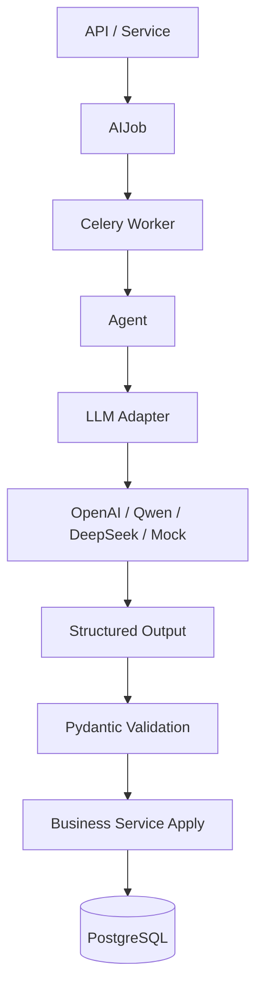

# Chronos LLM & Agent Architecture

> 本文定义 Chronos 的 LLM 接入方式、Agent 职责、AIJob 生命周期、结构化输出和降级策略。  
> 目标是让 AI 能增强每日执行闭环，但不破坏 Chronos 的克制、可信和用户控制感。

---

## 1. 设计目标

Chronos 的 AI 不是一个直接操纵业务数据的黑箱，而是一个可追踪、可降级、可替换的后台智能层。

核心目标：

- 支持 OpenAI / Qwen / DeepSeek 等不同模型供应商。
- 所有 AI 任务都可追踪、可失败、可重试。
- 所有 LLM 输出都必须结构化校验。
- 核心闭环不能因为 LLM 不可用而中断。
- 用户始终保留修正权和控制感。

核心原则：

```text
LLM 只产生结构化建议，
业务 service 决定如何落库。
```

---

## 2. 总体调用链路

```text
API / Service
-> create AIJob
-> Celery Worker
-> Agent
-> LLM Adapter
-> Structured Output
-> Schema Validation
-> Service Apply
-> DB Write
```



关键约束：

- API 不直接调用 LLM。
- Service 不绑定具体 LLM provider。
- Worker 负责执行和状态更新。
- Agent 负责具体 AI 任务逻辑。
- Adapter 负责模型供应商差异。
- Service 负责最终业务写入。

---

## 3. 推荐目录结构

```text
app/
  ai/
    client.py
    config.py

    providers/
      base.py
      openai.py
      qwen.py
      deepseek.py
      mock.py

    schemas/
      capture.py
      planning.py
      breakdown.py
      report.py

    prompts/
      capture_parser.md
      daily_planner.md
      task_breakdown.md
      daily_report.md

  workers/
    tasks.py
    agents/
      capture_parser.py
      daily_planner.py
      task_breakdown.py
      daily_report_generator.py
```

---

## 4. Provider Adapter 设计

业务代码不应该直接依赖 OpenAI、Qwen 或 DeepSeek SDK。

推荐抽象：

```python
from typing import Protocol, TypeVar
from pydantic import BaseModel

T = TypeVar("T", bound=BaseModel)

class LLMProvider(Protocol):
    def generate_structured(
        self,
        *,
        prompt: str,
        schema: type[T],
        temperature: float = 0.2,
        metadata: dict | None = None,
    ) -> T:
        ...
```

Provider 职责：

- 调用具体模型。
- 尽量使用模型原生 structured output / JSON mode。
- 返回 Pydantic schema 实例。
- 抛出统一异常。

不属于 Provider 的职责：

- 不写数据库。
- 不创建 Task / DailyPlan。
- 不判断业务状态机。
- 不处理用户权限。

---

## 5. LLM 配置

推荐 `.env` 配置：

```env
AI_ENABLE_REAL_LLM=false

LLM_PROVIDER=openai
LLM_MODEL=gpt-4.1-mini
LLM_API_KEY=
LLM_BASE_URL=

LLM_FALLBACK_PROVIDER=mock
LLM_TIMEOUT_SECONDS=30
LLM_MAX_RETRIES=2
```

P1 默认建议：

```text
AI_ENABLE_REAL_LLM=false
```

当前默认：

- `AI_ENABLE_REAL_LLM=false`
- Daily Planner 使用 mock provider 和 structured output shell。
- Planning Engine v1 仍是最终排序和 fallback 核心。
- 真实 provider 必须单独迭代接入，不能绕过业务层校验和用户确认边界。

---

## 6. AIJob 生命周期

所有异步 AI 任务必须对应一条 `AIJob`。

状态机：

```text
queued -> running -> succeeded
queued -> running -> failed
queued -> running -> succeeded_with_fallback
failed -> queued
running -> canceled
```

字段建议：

```text
AIJob {
  id
  user_id
  job_type
  status
  input_entity_type
  input_entity_id
  result_entity_type
  result_entity_id
  celery_task_id
  provider
  model
  prompt_version
  latency_ms
  error_message
  retry_count
  metadata
  started_at
  finished_at
  created_at
  updated_at
}
```

职责：

- 前端可以查询 AI 任务状态。
- 失败可以展示简短错误。
- 用户可以触发 retry。
- 后端可以审计 AI 执行历史。

状态语义：

- `succeeded`：LLM 正常完成，结果通过 schema validation。
- `succeeded_with_fallback`：LLM 调用失败或输出无效，但系统已使用 fallback 生成可用结果。
- `failed`：LLM 和 fallback 都未能产生可用结果，或任务不应自动降级。
- `canceled`：任务被取消，不再应用结果。

对应接口：

```text
GET  /api/v1/ai-jobs/{job_id}
POST /api/v1/ai-jobs/{job_id}/retry
```

---

## 7. P1 Agent 设计

P1 只实现四类 Agent。

### 7.1 Capture Parser

目的：

```text
把用户输入解析成候选 Task / Goal / InboxItem。
```

输入：

- CaptureInput
- 用户文本
- 可选上下文：已有 Goal 列表

输出：

- AIParseResult
- InboxItem

规则：

- 低置信度结果进入 Inbox。
- 不直接创建正式 Task / Goal。
- 用户确认后再由 InboxService 创建正式对象。

建议输出 schema：

```python
from datetime import date
from typing import Literal
from pydantic import BaseModel, Field

class ParsedItem(BaseModel):
    item_type: Literal["task", "goal", "idea", "unknown"]
    title: str
    description: str | None = None
    estimated_duration_min: int | None = None
    suggested_priority: int | None = None
    suggested_deadline: date | None = None
    suggested_goal_id: str | None = None
    confidence: float = Field(ge=0, le=1)

class CaptureParseOutput(BaseModel):
    items: list[ParsedItem]
    summary: str | None = None
```

失败 fallback：

- 将原始输入作为 `InboxItem`。
- `item_type = unknown`
- `AIJob.status = succeeded_with_fallback`
- 用户仍可手动确认 / 编辑。

### 7.2 Daily Planner

目的：

```text
生成今日推荐执行顺序和策略摘要。
```

当前实现状态：

- 已落地 Planning Engine v1，作为 deterministic planner core 和未来 LLM Daily Planner 的 fallback。
- Planning Engine v1 已读取任务价值、优先级、deadline、估时、依赖、用户修正、行为反馈、当日容量和 Energy 信号。
- 已接入 Daily Planner Agent shell：`PlanningService` 先生成 deterministic candidates，再调用 Agent 返回 structured output。
- 默认 provider 是 `mock`，模型标识为 `structured-mock-v1`；`AI_ENABLE_REAL_LLM=false` 时不会调用外部模型。
- 每次 plan revision 都记录一条 `AIJob(job_type=daily_planner)`，Strategy Detail `source.ai_job_id` 可追踪调用结果。
- Daily Planner prompt 已迁移到 `app/ai/prompts/daily_planner/p2-daily-planner-agent-v1.md`，通过 prompt registry 加载，并在 `AIJob.job_metadata.prompt_checksum` 里记录 checksum。
- v1 只允许 Agent 更新策略摘要和推荐理由；业务层校验禁止 Agent 改变任务集合、排序和 section。
- Agent 失败或输出不合法时，`AIJob.status=succeeded_with_fallback`，继续使用 Planning Engine v1 输出。
- 每个 `DailyPlanItem` 会保存 `score_breakdown`，Strategy Detail 可以解释排序，Today 首屏不展开完整评分。
- 超出容量的非保护任务进入 `section=rolled_over`；系统容量滚动不把 Task 本体改为 postponed。
- 已提供 `scripts/evaluate_planning_engine.py` 固定场景评估，覆盖容量滚动、受保护任务超载、低精力保护和高精力深度任务适配；后续 LLM Daily Planner 必须通过这些基线或显式更新评估预期。

输入：

- 未完成任务
- Light Goal 信息
- 用户设置
- 今日已有 DailyPlan
- 最近 ActivityEvent
- 可选精力状态

输出：

- DailyPlan
- DailyPlanItem
- StrategySnapshot
- PlanRevision

说明：

- `PlanRevision` 由 PlanningService 根据触发来源创建。
- LLM 不直接输出完整 revision，也不直接修改当前 DailyPlan。
- LLM 输出的是排序建议、分区建议和策略摘要；版本号、diff 和落库由业务 service 负责。

建议输出 schema：

```python
from typing import Literal
from pydantic import BaseModel

class PlanItemOutput(BaseModel):
    task_id: str
    section: Literal["pinned", "recommended", "low_priority", "rolled_over"]
    sort_order: int
    recommendation_reason: str
    score_breakdown: dict | None = None

class DailyPlanOutput(BaseModel):
    mode: Literal["light", "normal", "sprint"]
    strategy_summary: str
    primary_reason: str
    items: list[PlanItemOutput]
```

重要原则：

```text
P1 不建议完全依赖 LLM 排序。
```

推荐策略：

- Planning Engine v1 负责确定性基础顺序、容量筛选、`score_breakdown` 和 fallback。
- LLM 后续只增强策略摘要、推荐理由、异常场景判断和可解释性，不直接写业务表。
- Service 负责校验 LLM 输出是否违反依赖、容量和用户修正边界。
- Planner 相关改动应优先更新固定评估场景，避免“接口通过但排序退化”。

Planning Engine v1 已使用的信号：

- deadline
- priority
- value_level
- estimated_duration
- 是否多次延后
- 是否属于高价值目标
- 今日已完成 / 中断情况
- task dependencies
- user priority adjustment
- daily capacity
- EnergyDailyMetric

失败 fallback：

- 用 Planning Engine v1 生成 DailyPlan。
- StrategySnapshot 使用确定性摘要。
- `AIJob.status = succeeded_with_fallback`
- 用户仍然可以打开 Today。

### 7.3 Task Breakdown

目的：

```text
把任务拆解成可执行步骤。
```

输入：

- Task title
- Task description
- estimated_duration_min
- existing TaskStep

输出：

- TaskStep candidates

建议输出 schema：

```python
from pydantic import BaseModel

class BreakdownStepOutput(BaseModel):
    title: str
    sort_order: int

class TaskBreakdownOutput(BaseModel):
    steps: list[BreakdownStepOutput]
```

规则：

- 不自动覆盖已有步骤。
- 用户需要可编辑。
- P1 可以直接生成步骤，但必须允许后续编辑。

失败 fallback：

- 不生成步骤，不自动修改已有 `TaskStep`。
- `AIJob.status = succeeded_with_fallback`
- `result_entity_type` 可记录为 `task`，`result_entity_id` 记录原 `task_id`。
- `metadata.fallback_reason` 记录失败原因。
- 用户仍可手动添加步骤。

### 7.4 Daily Report Generator

目的：

```text
生成每日复盘摘要和轻量建议。
```

输入：

- 当日 ActivityEvent
- FocusSession
- DailyPlan
- Task 状态

输出：

- DailyReport.ai_summary
- DailyReport.ai_suggestions

建议输出 schema：

```python
from pydantic import BaseModel

class DailyReportOutput(BaseModel):
    summary: str
    suggestions: list[str]
```

表达要求：

- 简短。
- 温和。
- 不施压。
- 不制造焦虑。
- 给出下一轮优化方向。

失败 fallback：

- 用统计数据生成基础日报。
- AI summary 留空或使用默认模板。
- `AIJob.status = succeeded_with_fallback`

---

## 8. Structured Output 要求

所有 LLM 输出必须满足：

- 有明确 Pydantic schema。
- 通过 schema validation。
- 失败后记录错误。
- 不直接用自然语言硬解析。

推荐流程：

```text
raw model response
-> parse JSON / structured response
-> Pydantic validation
-> service apply
```

禁止：

- 直接把 LLM 自然语言写入业务字段。
- 依赖脆弱字符串解析。
- 让模型输出 SQL。
- 让模型决定是否删除或覆盖用户数据。

---

## 9. Fallback 策略

Chronos 的核心闭环不能依赖 LLM 成功。

| Agent | LLM 失败时 |
| --- | --- |
| Capture Parser | 原始输入进入 Inbox，类型 unknown，job 标记为 `succeeded_with_fallback` |
| Daily Planner | 使用 Planning Engine v1 生成 DailyPlan，job 标记为 `succeeded_with_fallback` |
| Task Breakdown | 不生成步骤，不写 `TaskStep`，用户手动添加，job 标记为 `succeeded_with_fallback` |
| Daily Report Generator | 使用统计模板生成基础报告，job 标记为 `succeeded_with_fallback` |

所有 fallback 都应：

- 记录 AIJob fallback 状态。
- 保留 error_message。
- 允许 retry。
- 不阻塞用户继续使用产品。

---

## 10. LangGraph 使用边界

P1 不需要为了使用 LangGraph 而把所有 AI 任务复杂化。

推荐：

- 简单任务先使用普通 Agent function。
- 多步骤、有状态、需要循环反思的任务再使用 LangGraph。

P1 可先不复杂使用 LangGraph：

- Capture Parser：普通 function 足够。
- Task Breakdown：普通 function 足够。
- Daily Report Generator：普通 function 足够。
- Daily Planner：当前是 Planning Engine v1 + structured Agent shell，后续多轮反馈和长期行为学习再升级为 LangGraph。

后续适合 LangGraph 的场景：

- 多轮 rolling plan 优化。
- 用户反馈后重新规划。
- 长期行为洞察。
- 多来源输入归并。
- P4 多人任务分配。

---

## 11. LLM 不能直接做的事

LLM 不应该直接：

- 创建正式 Task。
- 覆盖用户已有 TaskStep。
- 删除任务。
- 改用户设置。
- 修改 DailyPlan 当前版本。
- 重排正式数据。
- 推送通知。
- 写数据库。

LLM 可以：

- 生成候选解析结果。
- 给出任务拆解建议。
- 生成策略摘要。
- 生成推荐理由。
- 生成日报建议。

最终业务变更必须由 service 执行。

---

## 12. Prompt 管理

Prompt 应该版本化，避免散落在代码里。

推荐：

```text
app/ai/prompts/
  registry.py
  capture_parser/
    p1-capture-parser-v1.md
  daily_planner/
    p2-daily-planner-agent-v1.md
  task_breakdown/
    p1-task-breakdown-v1.md
  daily_report/
    p1-daily-report-v1.md
```

每个 Prompt 应包含：

- Agent 目标
- 输入上下文说明
- 输出 schema 说明
- 产品语气要求
- 禁止事项

Prompt registry 要求：

- Agent 通过 prompt key 获取 prompt，不直接读取硬编码字符串。
- Prompt version 必须进入 `AIJob.prompt_version`。
- Prompt checksum 必须进入 `AIJob.job_metadata`，用于回溯某次 AI 输出对应的具体 prompt 内容。
- 修改 prompt 内容时应新增或显式更新版本号，并同步迭代文档和评估结果。

Prompt 输出语气必须符合：

- 轻盈
- 克制
- 可信
- 不施压
- 不炫耀智能

---

## 13. Observability

P1 至少记录：

- AIJob status
- job_type
- provider
- model
- prompt_version
- latency
- error_message
- retry_count

可选后续扩展：

- token usage
- cost
- model raw output archive
- schema validation error details

注意：

- 不要在普通日志中输出用户隐私内容。
- raw_model_output 如需保存，应考虑脱敏和访问控制。

---

## 14. 与后端核心对象的关系

| AI 能力 | 输入对象 | 输出对象 | 是否用户确认 |
| --- | --- | --- | --- |
| Capture Parser | CaptureInput | AIParseResult / InboxItem | 是 |
| Daily Planner | Task / Goal / ActivityEvent / Planning Engine candidates | DailyPlan / DailyPlanItem / StrategySnapshot / AIJob trace | 用户可 replan / 调整 |
| Task Breakdown | Task | TaskStep candidates | 用户可编辑 |
| Daily Report Generator | ActivityEvent / FocusSession / DailyPlan | DailyReport | 不强制确认 |

---

## 15. 一句话原则

```text
Chronos 的 LLM 层负责提出可信的结构化建议，
业务层负责校验、取舍和落库，
用户始终保留修正权。
```
